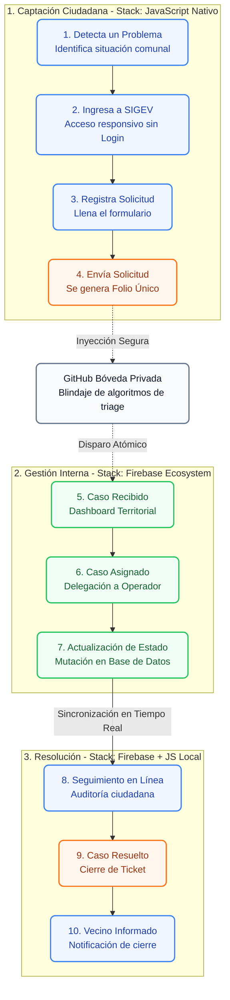

# 🏗️ Arquitectura Core y Sistema Multi-Tenant Dinámico

La arquitectura core de la plataforma **SIGEV** está diseñada bajo el modelo de software como servicio (**SaaS Multi-Tenant**) de aprovisionamiento dinámico en el lado del cliente. A diferencia de las estructuras tradicionales que despliegan instancias de servidores aisladas o bases de datos físicas separadas por cada municipio, SIGEV unifica todo el ecosistema en una única base de código estática (*Single Codebase*) y un único clúster NoSQL, resolviendo el aislamiento lógico y la personalización visual (*Branding Hydration*) en tiempo de ejecución mediante el análisis del Hostname del navegador.

---

## 1. 📖 Glosario Técnico del Módulo

| Término | Definición Técnica en SIGEV |
| :--- | :--- |
| **Hostname Parsing** | Proceso asíncrono que extrae y limpia la URL del navegador para aislar el identificador único de la municipalidad activa. |
| **Branding Hydration** | Inyección en caliente de hojas de estilos, paletas cromáticas, variables CSS e imágenes corporativas asociadas al Tenant resuelto. |
| **Aislamiento Lógico** | Restricción algorítmica obligatoria que intercepta cada query de Firestore inyectando el ID del Tenant para evitar la fuga cruzada de datos. |
| **Fallback Algorítmico** | Mecanismo de contingencia que asigna un Tenant seguro por defecto ante ingresos desde entornos locales o subdominios no registrados. |
| **Long-Polling Transport** | Configuración forzada de red que degrada la comunicación de WebSockets a peticiones HTTP continuas para evadir los Firewalls restrictivos municipales. |
| **State Manager Local** | Patrón de arquitectura donde variables de memoria global en la RAM actúan como única fuente de verdad, neutralizando llamadas redundantes al servidor. |
| **NoSQL Denormalization** | Estrategia de bases de datos que duplica datos estratégicos para acelerar las lecturas en el cliente y minimizar los costos de cómputo en la nube. |

---

## 2. 🕵️‍♂️ Motor de Resolución de Instancia y Enrutamiento SaaS

El ciclo de vida de cualquier sesión en la plataforma se inicia con la determinación de la identidad municipal. Ningún recurso de datos o elemento de interfaz se carga antes de que este motor resuelva la propiedad del Tenant.

### Mecánica de Detección de Instancia (usuarios.js / concejos.js)

1. **Extracción del Hostname:** El script captura la propiedad nativa `window.location.hostname` del navegador (ejemplo: `sigev-lacisterna.cl` o `sigev-maipu.firebaseapp.com`).
2. **Sanitización y Segmentación:** Aplica una división por arreglos utilizando el separador de punto (`.split('.')[0]`) y transforma la cadena estrictamente a minúsculas para normalizarla. Posteriormente, remueve mediante un reemplazo de caracteres de expresión regular el prefijo corporativo del ecosistema (`.replace('sigev-', '')`). El resultado es el token puro de la comuna (ejemplo: `lacisterna` o `maipu`).
3. **Persistencia en Almacenamiento de Sesión:** El token limpio se contrasta contra el almacenamiento del navegador utilizando la llave `sessionStorage.getItem('SIGEV_ACTIVE_TENANT')`. Si la llave está vacía, se inyecta el token actual para mantener la persistencia durante la navegación.
4. **Mecanismo de Failsafe (Fallback):** Si el token extraído corresponde a entornos de desarrollo, pruebas o aterrizaje corporativo (`localhost`, `127`, `landing` o cadenas vacías), el algoritmo autoevalúa la restricción y asigna de forma obligatoria el tenant maestro por defecto (`paz`), impidiendo errores de ejecución y detención del software.

---

## 3. 🗺️ Representación Gráfica de la Infraestructura

La correlación de infraestructura entre las solicitudes locales del cliente y el clúster de objetos y datos binarios de Google Cloud responde al siguiente esquema estructurado:

---

## 4. 🛤️ Diagrama de Flujo: Journey del Vecino y Stack Tecnológico

El siguiente diagrama detalla los 10 pasos exactos de interacción desde que el vecino detecta una anomalía hasta que la autoridad resuelve el caso. Este flujo está orquestado por tres capas tecnológicas: **JavaScript (JS)**, **Firebase** y **GitHub**.

### 🛠️ Desglose Técnico de la Integración de Tecnologías
* **JavaScript Nativo (JS):** Gobierna las interacciones del cliente. Ejecuta la sanitización, el formateo dinámico de RUT, restringe el peso de archivos adjuntos y realiza el barrido predictivo de la base de datos localmente en memoria RAM para anular la latencia de respuesta.
* **Firebase Ecosystem:** Provee la base de datos en tiempo real (Firestore) y el repositorio de imágenes (Storage). Utiliza transacciones atómicas para evitar colisiones de folios si múltiples vecinos envían solicitudes en el mismo milisegundo.
* **GitHub (Bóveda Privada):** Actúa como el núcleo de protección de propiedad intelectual. Protege las lógicas algorítmicas de segmentación territorial impidiendo que terceros puedan clonar el funcionamiento estructural del código fuente.

---

## 5. 🛡️ Capa de Aislamiento, Seguridad y Reglas de Conectividad

### 5.1. Blindaje de Consultas NoSQL en Firestore
Una vez resuelto el token mediante la constante global `CURRENT_TENANT_ID`, la seguridad de la información y el aislamiento de datos entre comunas se ejecutan a nivel de software mediante inyecciones forzadas de predicados de filtrado. Cada invocación al SDK de Firebase Firestore que realice operaciones de lectura masiva o mutaciones complejas (`getDocs`, `query`, `addDoc`, `setDoc`) tiene la obligación arquitectónica de incorporar el campo `tenantId` dentro de sus criterios lógicos.

Este blindaje garantiza que los administradores y gestores territoriales de un municipio queden completamente ciegos ante los expedientes, padrones de vecinos y solicitudes de las comunas colindantes, operando bajo un entorno virtualizado privado.

### 5.2. Evasión de Bloqueos de Red mediante Long-Polling Forzado
Las redes e infraestructura informática de las municipalidades operan bajo políticas estrictas de seguridad perimetral corporativa. Los firewalls y proxies institucionales descartan de forma sistemática las conexiones de transporte bidireccional basadas en el protocolo WebSockets, interrumpiendo el flujo en tiempo real de Firebase.

Para mitigar esta vulnerabilidad, la inicialización del núcleo del sistema sobrescribe el canal de transporte nativo del SDK de Firestore. Al inicializar la base de datos, se inyecta la directiva experimental `experimentalAutoDetectLongPolling: true` combinada con `useFetchStreams: false`. Esto fuerza al cliente NoSQL a degradar la conexión de forma controlada hacia ráfagas de peticiones HTTP seguras (*Long-Polling*), garantizando la entrega de paquetes de datos y la sincronización a través de los firewalls del gobierno local sin requerir aperturas de puertos especiales.

---

## 6. 🗄️ Estrategia de Infraestructura y Optimización de Costos

SIGEV opera sobre la infraestructura serverless de Firebase (Firestore y Storage). Debido al modelo de facturación basado en operaciones de lectura y escritura de Google Cloud, el diseño de la arquitectura implementa dos pilares de optimización de rendimiento:

### 6.1. Patrón State Manager Local (Caché en Memoria RAM)
Para evitar peticiones repetitivas ante eventos frecuentes de la interfaz (como el tipeo del usuario en barras de búsqueda o cambios de pestañas), el sistema descarga las colecciones completas del Tenant en un único viaje de red inicial (`cargarPersonalCore()`, `cargarDatosMaestrosConcejo()`). Los datos se empaquetan en arreglos globales de memoria RAM (`personalMemory`, `memorySesiones`). 

Estas variables actúan como la "Única Fuente de Verdad" o State Manager en caliente en el cliente. Las búsquedas predictivas y filtros multiparámetros se procesan localmente mediante funciones nativas de JavaScript (`.filter()`, `.slice()`), reduciendo el costo operacional del servidor de $O(N)$ a $O(1)$.

### 6.2. Denormalización Estructural de Nodos
Frente a las bases de datos relacionales tradicionales, la arquitectura NoSQL de SIGEV duplica campos maestros de forma estratégica. Por ejemplo, en los documentos hijos de la colección `votos_concejo`, se replican de forma atómica los campos `sesionNum` y `sesionFecha` del documento padre. Esto elimina la necesidad de realizar consultas cruzadas complejas (*Joins*) o peticiones en cascada al servidor, permitiendo renderizar tablas completas con una sola lectura directa.

---

## 7. 🎨 Inyección de Identidad Corporativa (Dynamic Hydration)

El motor Multi-Tenant no solo segmenta los datos, sino que personaliza la experiencia estética de cada municipio de forma dinámica:

* **Carga Paramétrica:** Al iniciar el entorno workspace, el sistema consulta el documento de configuración en la ruta `configuracion_tenant/{CURRENT_TENANT_ID}`.
* **Mutación Estructural:** Si la comuna cuenta con reglas específicas, el sistema sobreescribe las variables locales de control (como los departamentos y oficinas disponibles en `DEPARTAMENTOS_MUNICIPALES`) e inyecta las clases CSS correspondientes en las etiquetas del layout (`.tenant-branding`), adaptando los formularios, logos y menús al organigrama oficial del municipio en menos de un ciclo de reloj.