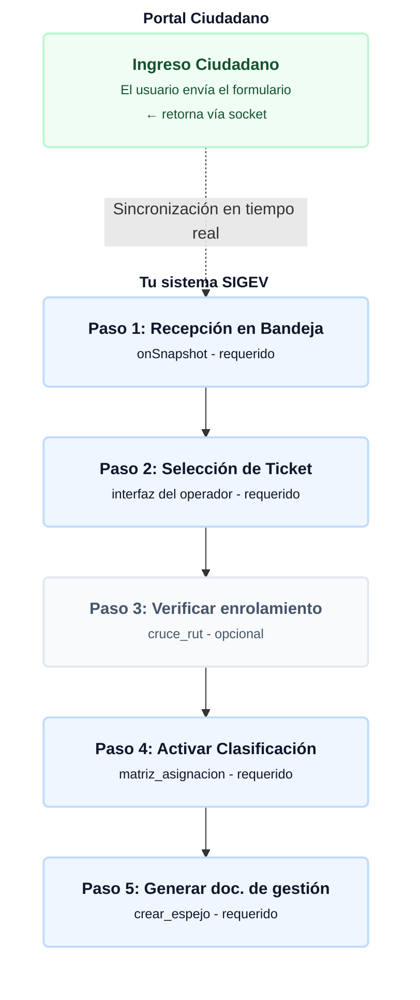

# 📥 Módulo de Buzón Ciudadano (Triage Digital)

El módulo `buzon.js` actúa como el centro de recepción neurológico de SIGEV. Su función principal es interceptar, en tiempo real, los requerimientos ingresados por los vecinos a través del portal web público o escaneos QR, someterlos a una verificación de identidad contra el Padrón de Vecinos, y transformarlos en tickets formales de gestión municipal.

---

## 1. Diagrama del flujo (Intercepción y Triage)
Azul = requerido · Gris = opcional · Verde = plataforma web externa

---

## 2. Motor Analítico en Tiempo Real (In-Memory Processing)

Para evitar sobrecostos por lecturas en Firebase (Billing Optimization), SIGEV no realiza consultas `.count()` separadas para las estadísticas superiores. Todo se calcula en la memoria RAM del cliente aprovechando la conexión de socket abierto (`onSnapshot`):

* **Tendencia Diaria (Trend Analytics):** El sistema captura el *Timestamp* actual y calcula la medianoche del día de hoy y de ayer. Filtra el arreglo local y devuelve el porcentaje de crecimiento (Ej: `▲ +15%` o `▼ -5%`) en la tarjeta de "Ingresos Digitales".
* **Frecuencia Condensada:** Extrae la variable texto plano ingresada por el vecino y la somete a la función `obtenerTipoCompacto()`, la cual agrupa cientos de variaciones en 5 categorías maestras (`Apoyo`, `Reclamo`, `Iniciativa`, `Agradecimiento`, `Denuncia`) para mostrar el "Canal Más Frecuente".
* **Métricas Desacopladas (QR):** Escucha dinámicamente un documento aislado en la colección `metricas_qr` asociado al ID del Concejal (`ID_CONCEJAL_AGUAYO_LC`) para mostrar el tráfico orgánico del formulario.

---

## 3. Verificador Criptográfico de Identidad (Cross-Validation)

Antes de que el equipo municipal gaste tiempo gestionando un ticket, el módulo ejecuta la función `verificarInscripcionVecinoBaseCentral()`.

> [!NOTE]
> **🛡️ Normalización de Entrada (Sanitization):**
> Dado que los vecinos escriben su RUT con distintos formatos en el portal web (con puntos, sin puntos, guiones, K minúscula), el motor aplica una expresión regular (`replace/[.\-\s]/g`) para crear un cuerpo limpio. 

1. **Matriz de Búsqueda:** El código genera un *Array* con todas las combinaciones posibles del RUT extraído (Formato estricto, formato limpio, DV en mayúsculas).
2. **Cruce de Colección:** Interroga la colección central `vecinos` mediante una cláusula `in`.
3. **Resolución de Bifurcación:**
   * Si detecta el RUT: Levanta el *badge* verde (`✓ Vecino Registrado`) que actúa como hipervínculo profundo (Deep Link) hacia la ficha del vecino.
   * Si no detecta el RUT: Levanta la alerta roja e inyecta el botón `action-crear-vecino`, el cual ejecuta la función `clonarFichaVecinal()` para copiar los datos del formulario directamente a la base de datos oficial del territorio.

---

## 4. Arquitectura de Re-Clasificación (Triage a Solicitud)

El Buzón Ciudadano no gestiona la parte operativa; su labor es filtrar. Cuando el operador presiona "Clasificar Requerimiento":

1. Se despliega el modal que exige seleccionar un Departamento y Responsable basados en la matriz algorítmica `MAPA_CLASIFICACION_SIGEV`.
2. Se genera el código de gobierno de datos: `SIG-[TENANT_ID]-[YYMMDD]-[CORRELATIVO]-[DEP]-[CAT]-[SUB]`.
3. Se ejecuta una escritura espejo: **Crea** un documento en la colección `solicitudes` (para el equipo técnico) y **Actualiza** el documento original en `buzon_ciudadano` a estado "Clasificado" (para mantener el seguimiento del portal web).

---

## 5. Optimizaciones UI/UX (CSS de Grado Empresarial)

El archivo `buzon.css` aborda uno de los problemas más comunes en las Single Page Applications (SPA) con tablas de alto volumen: **El Doble Scroll**.

> [!WARNING]
> **🖥️ Corrección Estructural de Viewport:**
> En lugar de usar medidas empaquetadas, el CSS bloquea el comportamiento nativo de la ventana del navegador inyectando `overflow: hidden !important; height: 100vh !important;` en los tags `html` y `body`. Inmediatamente después, delega la responsabilidad exclusiva de desplazar la pantalla a la clase `.main-content` mediante `overflow-y: auto`. Esto garantiza que la barra superior (TopBar) y el menú lateral (Sidebar) queden inmovilizados estáticamente, mientras solo la tabla de datos responde a la rueda del mouse.

---

## 6. Esquema del Documento de Datos (Estructura de Payload NoSQL)

Para auditorías técnicas, el documento indexado en la colección `buzon_ciudadano` de Cloud Firestore presenta la siguiente anatomía (que difiere ligeramente del módulo interno de solicitudes por su origen externo):

<pre>
{
  "tenantId": "aguayo",
  "codigo": "SIG-260613-0005",
  "codigoInterno": "SIG-AGUA-260613-0005-OBR-ALU-PUN",
  "asunto": "Luminaria apagada en la plaza",
  "tipo": "Reclamo",
  "categoriaOficial": "ALUMBRADO",
  "subcategoriaOficial": "Solicitud punto lumínico",
  "descripcion": "Hace dos semanas que la luminaria frente a los juegos está parpadeando.",
  "nombre": "María González",
  "rut": "15.123.456-7",
  "telefono": "+56 9 8765 4321",
  "email": "maria.g@ejemplo.cl",
  "direccion": "Pasaje Los Copihues 456",
  "estado": "Clasificado",
  "estadoGestion": "En revisión",
  "departamentoAsignado": "OBRAS",
  "responsableId": "user_id_alfanumerico",
  "responsableNombre": "Juan Técnico",
  "clasificadoPor": "Administrador",
  "fecha": "Timestamp (Server - Ingreso Web)",
  "fechaClasificacion": "Timestamp (Server)",
  "adjuntos": [
    "https://firebasestorage.googleapis.com/...foto_luminaria.jpg"
  ],
  "tieneExpediente": true
}
</pre>