# ⚙️ Centro de Configuración y Gobierno de Datos

El módulo de Configuración (`configuracion.js` y `mapeoMunicipal.js`) actúa como la **Consola Maestra de Administración** de SIGEV. Su propósito es centralizar la parametrización de la plataforma, gestionar la identidad visual (branding), auditar operaciones críticas, ofrecer herramientas de infraestructura para la inyección masiva de planillas de cálculo Excel, y almacenar los diccionarios geográficos de la comuna y las reglas de red perimetrales.

---

## 1. Diagrama de Flujo: Arquitectura Administrativa
Azul = Módulos UI · Verde = Operaciones Seguras · Gris = Herramientas · Rojo = Peligro Crítico

```mermaid
graph TD
    classDef azul fill:#eff6ff,stroke:#bfdbfe,stroke-width:2px,color:#0f172a;
    classDef gris fill:#f8fafc,stroke:#e2e8f0,stroke-width:2px,color:#475569;
    classDef verde fill:#f0fdf4,stroke:#bbf7d0,stroke-width:2px,color:#14532d;
    classDef rojo fill:#fef2f2,stroke:#fecaca,stroke-width:2px,color:#991b1b;

    subgraph Consola [Panel de Interfaz Administrativa]
        A("<div style='width: 280px; text-align: center; padding: 5px;'><b>Identidad y Branding</b><br><span style='font-size: 13px; font-weight: normal; color: #475569;'>Procesamiento de Imágenes &#40;CropperJS&#41;</span></div>"):::azul
        B("<div style='width: 280px; text-align: center; padding: 5px;'><b>Migración Excel &#40;SheetJS&#41;</b><br><span style='font-size: 13px; font-weight: normal; color: #475569;'>Inyección Masiva + Anti-Duplicados</span></div>"):::azul
        C("<div style='width: 280px; text-align: center; padding: 5px;'><b>Centro de Auditoría</b><br><span style='font-size: 13px; font-weight: normal; color: #475569;'>Monitoreo e Inspector Forense (Diff)</span></div>"):::azul
        D("<div style='width: 280px; text-align: center; padding: 5px;'><b>Constructor de Triage</b><br><span style='font-size: 13px; font-weight: normal; color: #475569;'>Enrutamiento Dinámico</span></div>"):::azul
    end

    subgraph Infraestructura [Motor de Persistencia]
        E("<div style='width: 280px; text-align: center; padding: 5px;'><b>Sincronización NoSQL</b><br><span style='font-size: 13px; font-weight: normal; color: #14532d;'>Escritura en config_tenant / Storage</span></div>"):::verde
        F("<div style='width: 280px; text-align: center; padding: 5px;'><b>Respaldo JSON Master</b><br><span style='font-size: 13px; font-weight: normal; color: #475569;'>Compilación Offline de Colecciones</span></div>"):::gris
        G("<div style='width: 280px; text-align: center; padding: 5px;'><b>Danger Zone &#40;Purga&#41;</b><br><span style='font-size: 13px; font-weight: normal; color: #991b1b;'>Borrado Irreversible de Datos</span></div>"):::rojo
    end

    A --> E
    D --> E
    B --> E
    C -.-> E
    E -.-> F
    F -.-> G
```



---

## 2. Motor de Inyección Masiva y Sanitización (Migración Excel)

Para evitar el ingreso manual de miles de registros históricos, SIGEV incorpora la librería `SheetJS` (`xlsx.full.min.js`), la cual procesa los archivos subidos directamente en la memoria RAM del navegador sin bloquear el hilo principal (`UI Thread`).

### 2.1. Flujo del Padrón de Vecinos (`cfg-excel-vecinos-file`)
Al cargar una planilla, el motor de migración ejecuta el siguiente pipeline:
1. **Limpieza Matemática:** Remueve puntos, espacios y guiones de los RUNs, forzando la mayúscula en el DV (`K`). Sanitiza teléfonos limpiando caracteres no numéricos.
2. **Geometría Territorial Predictiva:** Evalúa las columnas de calle y número para generar de forma determinista la propiedad `idHogar`. Esto vincula automáticamente a los núcleos familiares bajo un mismo identificador de vivienda.
3. **Previsualización Instantánea:** Realiza un corte parcial (`slice(0, 5)`) y renderiza de inmediato una tabla HTML dinámica (`#tbody-preview-vecinos`) para que el operador valide las columnas antes de impactar la base de datos.
4. **Asignación del Correlativo Humano:** El motor interroga el campo `vecinosTotal` en `counters_diarios` mediante una transacción atómica. A cada vecino inyectado se le asigna de manera secuencial e incremental su identificador público (Ej: `SIG-VEC-00142`).
5. **Escritura por Bloques (Batches):** Agrupa las filas mapeadas en subconjuntos rígidos de **400 registros**. Al alcanzar este límite, invoca la instrucción `batch.commit()`, instancia una nueva referencia mediante `writeBatch()` y reanuda el bucle para respetar el límite nativo de Firebase de 500 mutaciones por transacción.

### 2.2. Flujo de Reclamos y Solicitudes Históricas (`cfg-excel-solicitudes-file`)
Para la absorción de archivos pertenecientes a administraciones previas, el sistema implementa un engranaje relacional:
* **Cazador de Vínculos:** El algoritmo evalúa el RUT o el Nombre Normalizado de la fila contra el mapa en caché de los vecinos. Si detecta coincidencia, asocia el `id` en la propiedad `idVecino` del ticket; si no, sella el nodo con `"SIN_EXPEDIENTE_VINCULADO"`.
* **Escudo de Huella Única (Anti-Duplicidad):** Genera una llave hash con el RUT del solicitante y los primeros 40 caracteres de la descripción del caso. Si esa llave ya existe en el `Set` de solicitudes cargadas en la instancia activa, descarta la fila y la envía a la tabla de **Registros Omitidos**.
* **Mapeo Cronológico y Folio:** Convierte la cadena de texto de la fecha histórica en un objeto `Timestamp` nativo. El folio público del caso se genera extrayendo las dos últimas cifras del año, mes y día de *esa fecha en particular* (Formato: `SIG-[YYMMDD]-[CORRELATIVO]`) y estampa internamente el sufijo `-MIGRACION-EXCEL`.

### 2.3. Fusión Inteligente en Caliente (Upsert)
Si se encuentra una fila cuyo RUT carece de validación formal (`S/R-xxxx`), pero su teléfono de contacto o nombre normalizado coincide exactamente con un perfil registrado con anterioridad, el sistema ejecuta un **Upsert**: actualiza y completa las variables vacías del registro preexistente en lugar de inicializar un nuevo documento duplicado.

---

## 3. Identidad, Branding y Recorte del Lado del Cliente (CropperJS)

Con el fin de mitigar el consumo de ancho de banda, el módulo utiliza `CropperJS` del lado del cliente. 
Al interactuar con los selectores de archivos correspondientes a las marcas gráficas del sistema, la consola despliega el modal `#universal-cropper-modal` y fuerza de manera estricta una plantilla geométrica específica según el destino del recurso visual:
* **Banner del Portal:** Relación horizontal fija `1920 / 600`.
* **Foto de la Autoridad:** Relación cuadrada perfecta `1:1`.
* **Logotipo del Sidebar:** Relación adaptativa optimizada `240 / 80`.

Una vez que el usuario confirma el encuadre, la imagen es extraída del Canvas, convertida en un `Blob` de alta calidad y subida de manera directa a los buckets de **Firebase Storage**. Al completarse la carga, recupera la URL pública e impacta la matriz ubicada en `configuracion_tenant`.

---

## 4. Centro de Telemetría e Inspector Forense (Logs de Auditoría)

Cada alteración, borrado o mutación de variables realizado por los operadores de la oficina municipal genera un registro estructurado dentro de la colección central de `logs`, filtrado estrictamente por el `CURRENT_TENANT_ID`.

```
+-------------------------------------------------------------------------+
|                       INSPECTOR OPERATIVO FORENSE                       |
+-------------------------------------------------------------------------+
| LOG-ID: 7a8B9c4D2E                                 CRITICIDAD: WARNING  |
|-------------------------------------------------------------------------|
| Timestamp: 27/06/2026 17:02         Operador: gonzalo@lacisterna.cl     |
| Módulo: Vecinos                     Operación: MODIFICAR                |
| Entidad ID: v_doc_983172            Dirección IP: 190.161.42.10         |
|-------------------------------------------------------------------------|
| Detalle: Corrección de RUT y cambio de domicilio del beneficiario       |
|-------------------------------------------------------------------------|
| ESTADO PREVIO (ANTES):                                                  |
| { "direccion": "Goycolea 405", "idHogar": "HOG-goycolea-405" }          |
|-------------------------------------------------------------------------|
| ESTADO POSTERIOR (DESPUÉS):                                             |
| { "direccion": "Lima 8677", "idHogar": "HOG-lima-8677" }                |
+-------------------------------------------------------------------------+
```

### 4.1. Análisis y Paginación en Memoria RAM
Para prevenir el consumo desmedido de la cuota de lectura, la función `consultarLogsAuditoria()` descarga un tope de seguridad de 150 registros ordenados cronológicamente (`orderBy("timestamp", "desc")`).
* **Métricas en Caliente:** Al procesar el arreglo en memoria, la rutina `calcularMetricasDeAuditoria()` clasifica la telemetría en cuatro categorías de riesgo (`INFO`, `WARNING`, `ERROR`, `CRITICAL`), computando instantáneamente las tarjetas analíticas de la interfaz.
* **Paginación Dinámica Virtual:** La grilla divide los logs en subconjuntos de **12 registros por página**. La alternancia de bloques se realiza de forma local sobre la memoria RAM, eliminando la latencia de red y bloqueando peticiones adicionales a Firebase.

### 4.2. Compartición de Estados Basados en Datos (Diff Visual)
Al seleccionar un registro en la tabla de auditoría, se activa el contenedor expandible `#audit-pane-content` y se invoca el método `desplegarDetallesLogInspector()`. Esta interfaz toma los sub-objetos serializados `antes` y `despues` almacenados en el documento de origen. Al contrastar de forma paralela ambas propiedades, expone de manera exacta las variables modificadas, permitiendo revisiones transparentes y el control de malas prácticas operativas en segundos.

---

## 5. Herramientas de Respaldo de Infraestructura (JSON / CSV)

Para asegurar la soberanía de los datos sin depender del panel técnico de Google Cloud Console, el sistema incluye sub-rutinas independientes de extracción:
* **Compilación JSON Master:** Gatilla una batería de consultas simultáneas (`Promise.all`) sobre las colecciones críticas (`vecinos`, `solicitudes`, `donaciones`). Consolida las colecciones en un único archivo plano estructurado y gatilla la descarga automatizada bajo la nomenclatura `RESPALDO_MASTER_SIGEV_[TENANT]_2026.json`.
* **Exportador CSV Forense:** Recorre la memoria local de la grilla de logs, escapa comillas dobles, limpia saltos de línea para prevenir corrupción de registros y escribe una cadena delimitada por comas apta para auditorías externas.

---

## 6. Configuración, Dominios y Gobierno de Red

El despliegue de **SIGEV** en producción se rige por una arquitectura perimetral administrada a través de **Cloudflare**. Este servicio actúa como proxy inverso, escudo de seguridad (WAF) y gestor de DNS. Cloudflare recibe el tráfico de internet y lo enruta dinámicamente hacia la infraestructura *Serverless* de Google (Firebase Hosting).

### 6.1. Desglose Estructural de Dominios en Cloudflare

| Subdominio | Propósito Funcional | Configuración Técnica (Destino) |
| :--- | :--- | :--- |
| **`aguayo.sigev.cl`** | **App SaaS (Tenant).** Es el núcleo operativo donde inician sesión los gestores territoriales. | Apunta a la IP de Firebase (`199.36.158.100`). Tiene el **Proxy de Cloudflare Activado** (Nube Naranja) para protección Anti-DDoS y validación WAF. El registro TXT lo asocia al entorno `sigev-aguayo`. |
| **`sigev.cl`** y **`www`** | **Portal Público (Landing Page).** La cara visible hacia la ciudadanía donde se explican los servicios. | Apunta a Firebase Hosting. El DNS es directo (*DNS Only*). Enlazado al entorno `sigev-landing`. |
| **`docs.sigev.cl`** | **Centro de Documentación.** Aloja los manuales de usuario y documentación técnica (Docsify). | Redirección `CNAME` hacia `sigev-docs.web.app`. |
| **`send.sigev.cl`** | **Canal de Emisión de Correos.** Subdominio interno dedicado a despachar notificaciones transaccionales. | Delegado a la infraestructura de envíos masivos de **Amazon SES** (Simple Email Service). |

### 6.2. Orquestación Multi-Sitio en Firebase (`firebase.json`)

Para conectar los dominios mapeados en Cloudflare con las carpetas físicas correctas del código fuente, SIGEV utiliza la característica **Multi-Site de Firebase Hosting**. El archivo `firebase.json` actúa como el enrutador interno del servidor de Google, definiendo tres *Targets* (objetivos) independientes que permiten operar bajo una arquitectura de **Monorepositorio**:

```json
{
  "hosting": [
    {
      "target": "landing",
      "public": "sitios/landing",
      "ignore": ["firebase.json", "**/.*", "**/node_modules/**"]
    },
    {
      "target": "plataforma",
      "public": "sitios/plataforma",
      "ignore": ["firebase.json", "**/.*", "**/node_modules/**"]
    },
    {
      "target": "documentacion",
      "public": "docs",
      "ignore": ["firebase.json", "**/.*", "**/node_modules/**"]
    }
  ]
}
```

* **Target `landing`**: Toma el código estático de la carpeta `sitios/landing` y lo empuja al servidor público asociado a los registros raíz `sigev.cl`.
* **Target `plataforma`**: Toma el código de la carpeta `sitios/plataforma` (donde reside la lógica de la App SaaS) y lo publica en el entorno asignado a `aguayo.sigev.cl`.
* **Target `documentacion`**: Aísla la carpeta `docs` (motor Markdown Docsify) y la despliega en `docs.sigev.cl`.
* **Ventaja Operativa**: Esto permite al equipo de desarrollo realizar despliegues quirúrgicos. Por ejemplo, al ejecutar `firebase deploy --only hosting:documentacion`, el manual se actualiza en vivo sin riesgo de causar caídas o afectar el código de la plataforma principal.

### 6.3. Seguridad y Ecosistema de Correo Electrónico

La zona DNS implementa un sistema de manejo de correos electrónico avanzado separando la recepción de la emisión automatizada para proteger la reputación del dominio (Deliverability).

* **Recepción (Inbound):** Gestionado a través de *Cloudflare Email Routing*, redirigiendo correos de `@sigev.cl` a bandejas corporativas. Validado por la llave DKIM `cf2024-1._domainkey.sigev.cl`.
* **Emisión (Outbound vía Resend / Amazon SES):** El backend envía correos (ej. 2FA) utilizando Resend y Amazon SES. El registro TXT autoriza a las IPs mediante `v=spf1 include:amazonses.com ~all`.
* **Política DMARC (Anti-Spoofing):** El registro `_dmarc.sigev.cl` contiene la cadena `"v=DMARC1; p=none;"`. Instruye a servidores globales a monitorear si un correo dice venir de `@sigev.cl` pero falla las firmas criptográficas.

---

## 7. Constructor Dinámico de Triage (Routing Engine)

SIGEV de-satura y elimina la necesidad de alterar el código fuente ante reestructuraciones internas en el organigrama del municipio. La función administrativa `recolectarMapaTriageUI()` barre secuencialmente las tarjetas de enrutamiento modeladas de forma visual por el usuario en la pantalla.

El motor procesa de manera automática los textos para generar prefijos de 3 letras unívocos (Ej: `AYUDA SOCIAL` -> `SOC`). Construye un diccionario JSON estructurado que es inyectado de inmediato dentro de `configuracion_tenant`. Este mapa es leído en tiempo real por el Módulo de Solicitudes y el portal ciudadano para derivar los reclamos a las oficinas de destino correspondientes (`DIDESO`, `OBRAS`, `DIMAO`, etc.) sin intervención humana.

---

## 8. Diccionarios Maestros Estáticos de Respaldo (`mapeoMunicipal.js`)

Como mecanismo de resiliencia ante contingencias de red, pérdida de conectividad o inicializaciones de instancias de bases de datos desde cero, el código exporta matrices maestras por defecto que gobiernan la geografía de la comuna.

```json
"Sector Territorial 1": {
    "uvs": ["1-A", "1-B", "1-C", "No Sabe / Sin Información"],
    "juntas": {
        "1-A": ["Lo Ovalle"],
        "1-B": ["Sin Información / No Sabe"],
        "1-C": ["Sin Información / No Sabe"],
        "No Sabe / Sin Información": ["Los Troncos", "Renacimiento", "La Blanca", "Sin Información / No Sabe"]
    }
}
```

> [!IMPORTANT]
> **🛡️ Control de Errores (Fallback Geográfico):**
> Todas las jerarquías del objeto geográfico incluyen por diseño obligatorio la opción `"No Sabe / Sin Información"`. Esto garantiza que los flujos de registro en terreno jamás queden bloqueados si el encuestador desconoce la junta de vecinos de la vivienda.

---

## 9. Control de Visibilidad y Alertas Automatizadas

El panel de administración gobierna de forma paramétrica las rutinas en segundo plano del sistema, persistiendo banderas lógicas (`true/false`) dentro de las llaves del Tenant:
* **Gestión de Capas del Dashboard:** Los interruptores directos (`showSolAbiertas`, `showInversionSocial`, etc.) deciden de manera condicional si los componentes gráficos analíticos de la pantalla de bienvenida se inyectan en el DOM, permitiendo adaptar la experiencia si no se utilizan ciertos módulos.
* **Triggers de Sistema:** Variables operativas como `notificarUrgentesEmail` y `alertaTicketsTreintaDias` activan temporizadores internos de red y flujos de mensajería inmediatos.

---

## 10. Blindaje Estructural para Modo Oscuro (CSS)

El archivo `configuracion.css` implementa una arquitectura avanzada de selectores condicionales para adaptar la visualización al Modo Oscuro sin arriesgar la legibilidad de las filas de datos.

Para evitar la inyección redundante de clases en los elementos del DOM, el motor CSS lee e intercepta directamente el valor de la propiedad de estilo inyectada en la etiqueta raíz `<html>`:

```css
html[style*="--bg-workspace: #0f172a"] .config-pane-view input {
    background-color: #1e293b !important;
    color: #f8fafc !important;
    border-color: #334155 !important;
}
```

Si el sistema detecta el hexadecimal oscuro (`#0f172a`), se aplica una mutación inmediata forzada (`!important`) que reconfigura fondos y contrastes en contenedores sensibles (como previsualizaciones de Excel), impidiendo que el texto sea invisible.