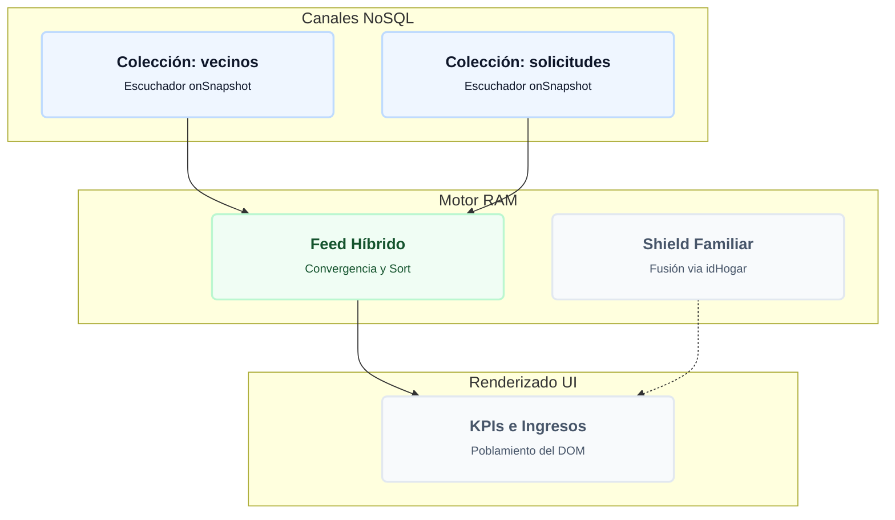

# 🎛️ Dashboard Informativo y Central Analítica

El módulo `dashboard.js` opera como la torre de control operativa y central analítica de SIGEV. Su propósito fundamental es converger múltiples flujos de datos NoSQL asíncronos y reactivos en una única interfaz unificada, permitiendo a los gestores municipales monitorear los indicadores críticos (KPIs) de la comuna, ejecutar acciones operativas rápidas y exportar auditorías analíticas en tiempo real.

---

## 1. Diagrama de Flujo: Consolidación Analítica Reactiva
Azul = Canales NoSQL · Verde = Motor RAM · Gris = Interfaz UI



---

## 2. Arquitectura del Feed Unificado Cronológico (RAM Convergence)

El componente `#unified-feed-list` unifica los ingresos de la plataforma en tiempo real. En lugar de realizar lecturas cruzadas en el servidor, la rutina `renderizarFeedUnificado()` centraliza los datos del lado del cliente:
1. **Normalización Estructural:** Recorre los arreglos reactivos locales (`totalVecinosMemory`, `totalSolicitudesMemory`, `totalDonacionesMemory`, `totalBuzonMemory`) e inyecta los elementos en una matriz común homogeneizando sus firmas (Icono, Título, Subtítulo y fecha homologada).
2. **Sort de Alto Rendimiento:** Ejecuta un ordenamiento elástico basándose en la estampa de tiempo decimal de los nodos (`b.dateObj.getTime() - a.dateObj.getTime()`).
3. **Poda de Concurrencia:** Aplica un método `slice(0, 5)` para renderizar exclusivamente los últimos 5 impactos, minimizando las mutaciones del DOM.

---

## 3. Escuchadores Multi-Tenant en Tiempo Real

Para asegurar la veracidad de los KPIs, el motor inicializa suscripciones persistentes mediante `onSnapshot()`. Cada canal inyecta una cláusula de seguridad restrictiva de aislamiento: `where('tenantId', '==', CURRENT_TENANT_ID)`. Esto garantiza que los datos cargados en memoria pertenezcan única y exclusivamente al espacio de trabajo asignado al operador.

---

## 4. KPIs Analíticos y Rastreo de Tráfico (QR vs URL Directa)

La función `procesarYRenderizarMetricasDashboard()` calcula las tendencias del Workspace:
* **Métrica Vecinal:** Compara el string indexado del día con `fechaRegistro` para computar los nuevos enrolados del día.
* **Algoritmo de Atribución Digital:** Para medir el impacto real de las campañas impresas, el sistema cruza los datos de visitas web aplicando la siguiente fórmula deductiva:
  $$	ext{Visitas URL Directas} = \max(0, 	ext{Total Registros Buzón} - 	ext{Métricas QR Scans})$$
  Donde `Métricas QR Scans` proviene del documento unificado `metricas_qr`.

---

## 5. Acciones Rápidas con Flujo Interrumpido (Smart Modals)

Los botones laterales de la grilla ejecutan aberturas de consolas modales eficientes que agilizan los flujos de terreno mediante interrupciones inteligentes:
* Al digitar un RUT en `abrirModalNuevaSolicitudTriage()`, el sistema inspecciona la memoria. Si el RUN existe, completa el DOM con el Nombre, Dirección y Teléfono, habilitando el guardado rápido del ticket.
* **Bifurcación de Alta:** Si el RUN arroja el estado `✗ No Registrado`, emerge la acción `+ Enrolar Vecino`. Al presionarlo, el modal se destruye y levanta en caliente el **Formulario Modular de Registro Avanzado**, heredando el RUT digitado.

---

## 6. Georreferenciación Bidireccional Automatizada (Nominatim API)

El formulario de registro avanzado integra el contenedor `#v-mini-mapa-picker` operado mediante Leaflet JS. Este componente implementa un flujo de doble vía:
1. **Geocodificación Inversa (Map to Text):** Al hacer clic sobre cualquier coordenada del mapapicker, el sistema gatilla una petición asíncrona a la API de Nominatim (`nominatim.openstreetmap.org/reverse`). Extrae las propiedades de calle y número e inyecta automáticamente la dirección en el input `#v-direccion`.
2. **Geocodificación Directa (Text to Map):** Cuando el operador escribe manualmente una dirección y pierde el foco (`blur`), el sistema realiza un fetch de búsqueda. Si localiza la ubicación, reubica el centro del mapa y traslada el pin hacia el nuevo eje geométrico.
3. **Polígonos de Autodetección:** Al establecerse las coordenadas por cualquier vía, la rutina `autoDetectarSector(lat, lng)` ejecuta un bucle de ray-casting sobre los polígonos del mapa. Si coincide, altera el selector del Sector Territorial, poblando en cascada las Unidades Vecinales.

---

## 7. Algoritmo del Escudo de Coincidencia Familiar (`idHogar`)

Al dar de alta a un vecino, el software calcula una firma de vivienda unificando las cadenas de texto de las calles:
$$	ext{idHogar} = 	ext{'HOG-'} + 	ext{Normalize}(	ext{Dirección Principal} + 	ext{'-'} + 	ext{Dirección Complementaria})$$
* **Control de Núcleos:** El motor analiza si el `idHogar` ya existe. De encontrar coincidencia, invoca `mostrarModalShieldFamiliar()`, desplegando una alerta que obliga al operador a decidir si el nuevo inscrito forma parte del núcleo familiar (heredando el `idHogar` original para subsidios conjuntos) o si constituye una vivienda independiente, añadiendo un sufijo único (`-IND-[Timestamp]`).

---

## 8. Saneamiento Forense contra Perfiles Fantasma

Para evitar la duplicación de identidades generadas por derivaciones digitales previas (Ej: Buzón Ciudadano), el sistema ejecuta una validación de sanidad:
* El motor aplica limpieza fonética e insensibilidad a mayúsculas sobre el nombre completo: `normalize('NFD').replace(/[\u0300-\u036f]/g, '')`.
* El algoritmo barre `totalVecinosMemory` buscando registros provisionales cuyo identificador inicie con el prefijo `"S/R-"` (Sin RUT). Si el número telefónico o el nombre normalizado coincide, el software interrumpe el guardado y dispara un bloqueo informativo, obligando a sanear la ficha existente.

---

## 9. Códigos de Triage Interno y Transacciones Atómicas

Al despachar un requerimiento presencial, el sistema actualiza los correlativos diarios mediante transacciones seguras (`runTransaction`) para evitar condiciones de carrera. Genera el código público final (`SIG-[YYMMDD]-[CORRELATIVO]`) y construye un identificador interno unificando las iniciales de 3 letras de la oficina, categoría y subcategoría (Ej: `SIG-PAZ-260627-0014-DID-SOC-GIF` para DIDESO - Social - Giftcard).

---

## 10. Motor de Exportación Local (SheetJS Integration)

Para evitar la dependencia de procesos en servidores externos, el Dashboard integra la extracción de reportes Microsoft Excel (`.xlsx`) de forma directa en el cliente mediante `ejecutarProcesamientoYExportacionExcel(tipo)`:
* **Lazy Loading:** Para optimizar la velocidad de inicio, el motor SheetJS no se carga por defecto. Solo al presionar Exportar, el script inyecta la biblioteca vía promesa de red.
* **Mapeo Tabular Plano:** La rutina transforma las matrices NoSQL desestructuradas en filas tabulares planas (`Array of Arrays`) compatibles con hojas de cálculo mediante `XLSX.utils.aoa_to_sheet()`.

---

## 11. Generador Dinámico de Códigos QR de Captación

El componente interactivo `#btn-trigger-qr-viewer` realiza una petición HTTPS hacia la API externa de `qrserver.com`, inyectando dinámicamente el subdominio del espacio de trabajo del cliente actual (`https://${CURRENT_TENANT_ID}.sigev.cl/index.html?c=${CURRENT_TENANT_ID}`). La interfaz despliega un visor premium para copiar el hipervínculo en el portapapeles o descargar la matriz gráfica `.png` para imprentas o volantes de terreno.

---

## 12. Adaptabilidad Estética y Aislamiento de Contraste (Theme Blindage)

El archivo `dashboard.css` implementa una arquitectura avanzada de selectores condicionales para adaptar la visualización de las tarjetas, modales y tablas al Modo Oscuro corporativo en caliente.

A través del selector de atributo (`style*`), el motor CSS inspecciona los cambios inyectados por el Layout maestro en la etiqueta raíz `<html>` o en el bloque `.main-content`:

```css
.main-content[style*="--bg-workspace: #0f172a"] .section-card,
.main-content[style*="--bg-workspace: #0f172a"] input {
    background-color: #1e293b !important;
    color: #f8fafc !important;
    border-color: #334155 !important;
}
```

### Mecánica del Blindaje de Interfaz
Cuando el sistema activa la paleta nocturna (`#0f172a`), estas reglas heredan prioridad máxima (`!important`), forzando el rediseño estructural de los componentes de entrada (inputs a gris pizarra y fuentes a blanco tiza) y de las grillas de calendario, pintando los fondos en tonos oscuros y forzando que los números indicadores del mes adquieran grosor tipográfico alto y color de alto contraste, neutralizando las áreas invisibles.