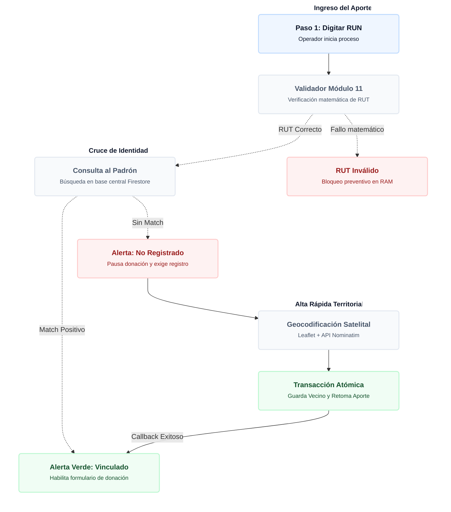

# 🎁 Motor de Donaciones Territoriales y Aportes Sociales

El módulo `donaciones.js` gestiona el seguimiento, stock y asignación de ayudas sociales a las familias de la comuna. Su arquitectura destaca por entrelazar el registro de entregas con la base central de vecinos, previniendo el fraude y asegurando que ninguna donación se asigne a un "perfil fantasma" o a un RUT inválido matemáticamente.

---

## 1. Diagrama de Flujo: Captura, Verificación y Alta Rápida

El siguiente diagrama detalla la lógica de interrupción inteligente. Si un operador intenta registrar una donación a un vecino no enrolado, el sistema pausa el flujo, exige la creación del perfil territorial (con geocodificación) y luego retoma automáticamente la donación original:

---

## 2. Validador Criptográfico (Módulo 11)

A diferencia del Buzón Ciudadano (donde el usuario puede equivocarse escribiendo su RUT), el módulo de Donaciones es un entorno de alta seguridad que exige precisión legal. 
El sistema implementa la función `validarRutChileno(rutCompleto)` que aplica el algoritmo del **Módulo 11** directamente en la memoria del navegador. Si un operador ingresa un RUT con un dígito verificador falso, el sistema lo detecta matemáticamente y bloquea la consulta a la base de datos, ahorrando lecturas inútiles en la nube de Firebase.

---

## 3. Generación Dual de Códigos y Trazabilidad

Cada aporte social recibe dos identificadores únicos inyectados mediante la función `generarCodigosSIG()`, balanceando usabilidad y minería de datos:

1. **Código Público (Orientado al Vecino):** Formato corto `SIG-[YYMMDD]-[CORRELATIVO]` (Ej: `SIG-260613-0005`). Se utiliza para entregarle un recibo o número de seguimiento al ciudadano.
2. **Código Interno Ampliado (Metadata Operativa):** Formato analítico `SIG-[TNT]-[YYMMDD]-[CORRELATIVO]-DON-[CAT]-[USR]` (Ej: `SIG-PAZ-260613-0005-DON-ALI-ADMI`). Este string contiene la categoría de la ayuda (Ej: `ALI` para Alimentos, `MED` para Médico) y el nombre abreviado del operador que autorizó el gasto, permitiendo hacer búsquedas masivas instantáneas sin necesidad de filtros complejos.

---

## 4. Consola de Alta Avanzada y Escudos de Seguridad

Si un vecino solicita una donación pero no existe en el sistema, SIGEV levanta el `overlayAvanzado` bloqueando la pantalla.

> [!WARNING]
> **🛡️ Escudo Anti-Fantasmas:**
> Durante el registro del nuevo vecino, el motor normaliza el nombre (quita tildes y mayúsculas) y cruza el número de celular contra expedientes antiguos importados sin RUT (`S/R-1234`). Si detecta una coincidencia fonética o telefónica, lanza una **Alerta de Perfil Duplicado**, obligando al operador a actualizar la ficha antigua en lugar de crear una nueva, manteniendo la base de datos limpia.

Además, el proceso de alta integra **Leaflet JS** y la API **Nominatim** para realizar *Reverse Geocoding*. Al pinchar en el mapa, el sistema recupera la dirección real (Calle y Número) y detecta matemáticamente (Ray-Casting) a qué Sector Territorial y Unidad Vecinal pertenece el beneficiario.

---

## 5. KPIs Financieros y Operativos (In-Memory)

Para controlar el gasto social sin saturar la cuota de lectura de Firestore, la función `actualizarMetricasKpi()` procesa los datos en el cliente:
* Recorre el arreglo local `donacionesMemory`.
* Cuenta los estados del ciclo de vida (`En revisión`, `En gestión`, `Autorizada`, `Entregada`, `Vencida`).
* Acumula el costo en la variable `totalMonto` sumando `montoGasto` solo de las donaciones con estados positivos, formateando la salida mediante `Intl.NumberFormat('es-CL')` para generar el valor final visible en pantalla.

---

## 6. Esquema del Documento de Datos (Estructura de Payload NoSQL)

El registro financiero e histórico que se indexa en la colección `donaciones` de Cloud Firestore presenta la siguiente matriz de datos:

<pre>
{
  "tenantId": "paz",
  "idVecino": "doc_id_firebase_alphanumeric",
  "rutVecino": "12.345.678-9",
  "nombreVecino": "María Rosa Pérez",
  "codigoPublico": "SIG-260613-0002",
  "codigoInterno": "SIG-PAZ-260613-0002-DON-ALI-ADMI",
  "codigo": "SIG-260613-0002",
  "tipoDonacion": "Canasta de Alimentos",
  "cantidad": "2 unidades",
  "montoGasto": 45000,
  "detalle": "Familia de 5 integrantes. Jefe de hogar cesante. Se aprueba apoyo.",
  "estado": "Autorizada",
  "registradoPor": "Administrador",
  "fechaCreacion": "Timestamp (Server)",
  "fechaAutorizacion": "Timestamp (Server) - Opcional",
  "fechaEntrega": "Timestamp (Server) - Opcional",
  "fechaRechazo": "Timestamp (Server) - Opcional",
  "resolucionNota": "Retirar el martes en bodega central con carnet de identidad."
}
</pre>

---

## 7. Experiencia de Usuario y Renderizado (UI/UX Core)

El módulo de donaciones no solo se centra en la seguridad de los datos, sino en optimizar la velocidad operativa del equipo en terreno mediante tres micro-arquitecturas de interfaz:

### 7.1. Paginación en Memoria RAM (Client-Side)
A diferencia de los sistemas tradicionales que interrogan a la base de datos cada vez que se cambia de página, SIGEV implementa una paginación del lado del cliente (`slice(inicio, fin)`). 
* Toda la colección filtrada vive en el arreglo `donacionesFiltradasGlobal`.
* Al cambiar el límite de visualización (10, 25 o 50 registros) o navegar con las flechas, el sistema simplemente redibuja el DOM en milisegundos sin consumir cuota de lectura (Billing) en Cloud Firestore.

### 7.2. Motor Inteligente de Tooltips (Hover Analytics)
Para evitar que el operador tenga que hacer clic y abrir cada donación solo para leer su resumen, el sistema inyecta la función global `window.mostrarTooltipTicket`.
* **Cálculo de Colisión (`getBoundingClientRect`):** El código evalúa las coordenadas matemáticas del cursor. Si detecta que la caja flotante está a punto de salirse por el borde inferior de la pantalla (`window.innerHeight`), recalcula su eje `Y` dinámicamente para mantenerse siempre visible.

### 7.3. Expediente Digital 360° (Visor Integrado)
Al hacer clic en "Ver Ficha Vecino" dentro de un aporte, se invoca `abrirVisorVecino(id)`. Esta función no saca al usuario del módulo de donaciones, sino que levanta una consola modal en capa superior (`z-index: 2500`) con navegación por pestañas:
1. **Datos Básicos:** Foto de perfil, RUN, información de contacto y sector geográfico.
2. **Aportes Recibidos:** Consulta en caliente a Firestore (`where("idVecino", "==", id)`) que construye una línea de tiempo cronológica con todas las donaciones históricas que ha recibido esa familia, permitiendo al operador auditar si existe abuso del sistema o sobre-asistencia territorial.
3. **Documentos:** Acceso directo a los respaldos en PDF (ej. Ficha de Protección Social) alojados en Firebase Storage.