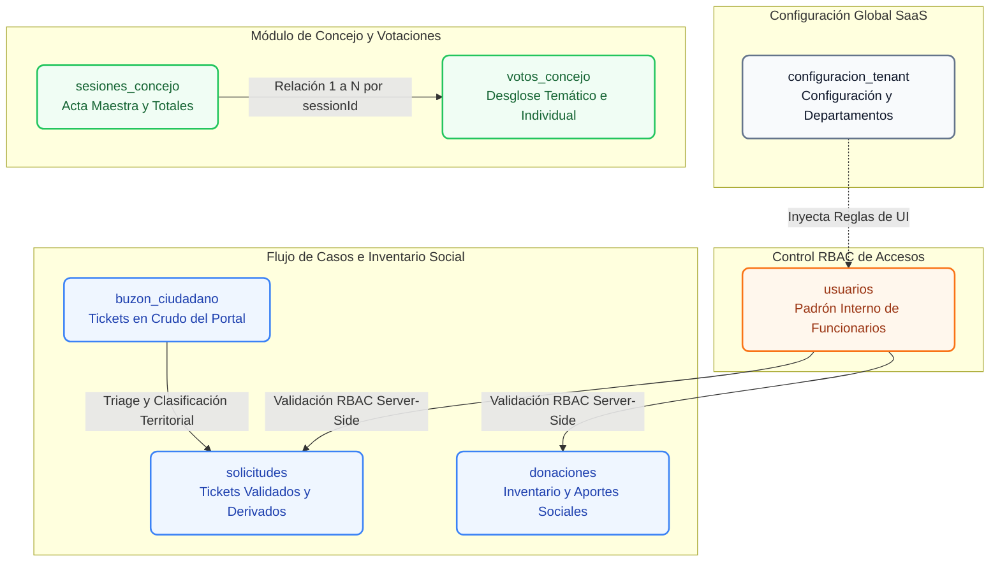

# 🗃️ Modelo NoSQL Firestore y Estructura de Colecciones

La persistencia de datos de la plataforma **SIGEV** está construida sobre una base de datos NoSQL orientada a documentos mediante **Google Cloud Firestore**. Al operar en un entorno SaaS Multi-Tenant sobre una estructura no relacional, el diseño del modelo implementa técnicas de desnormalización atómica, gobernadas por **Reglas de Seguridad Server-Side (RBAC)** que aíslan criptográficamente la información de cada organización o tenant.

---

## 1. 📖 Glosario Técnico del Módulo

| Término | Definición Técnica en SIGEV |
| :--- | :--- |
| **Colección Matriz** | Repositorio raíz en Firestore que agrupa documentos de una misma naturaleza (Ej: `usuarios`, `solicitudes`). |
| **Server-Side RBAC** | Control de Acceso Basado en Roles evaluado directamente en los servidores de Google mediante funciones `exists()` y `get()` en `firestore.rules`, imposible de evadir desde el frontend. |
| **Cachabache (Default Deny)** | Regla de seguridad final que bloquea lectura y escritura a cualquier colección que no haya sido explícitamente declarada en el archivo de reglas. |
| **Logs Inmutables** | Documentos de auditoría que, por regla estricta de base de datos (`allow update, delete: if false`), no pueden ser alterados ni borrados por ningún tipo de perfil de usuario. |

---

## 2. 🗺️ Arquitectura Lógica del Modelo de Datos

El siguiente mapa relacional detalla cómo se vinculan las colecciones raíz del clúster SIGEV. Aunque Firestore es *Schema-less*, el sistema fuerza estructuras JSON consistentes a nivel de código para asegurar la integridad operativa de todos los entornos distribuidos:



---

## 3. 🔒 Reglas de Seguridad de Servidor (`firestore.rules`)

La seguridad de SIGEV no depende de ocultar elementos de la interfaz en el HTML. Se rige por un **escudo perimetral en la nube** que verifica la existencia del perfil del operador, su identidad, rol y la jurisdicción de su Tenant antes de procesar cualquier transacción en el backend.

A continuación se presenta el código fuente definitivo de producción:

```javascript
rules_version = '2';
service cloud.firestore {
  match /databases/{database}/documents {

    // =====================================================================
    // 🛡️ FUNCIONES MAESTRAS DE SEGURIDAD (RBAC Y MULTI-TENANT)
    // =====================================================================

    // 1. Verifica si el usuario actual ya tiene un perfil creado
    function existeMiPerfil() {
      return exists(/databases/$(database)/documents/usuarios/$(request.auth.uid));
    }

    // 2. Obtiene los datos del pasaporte del usuario actual
    function getMiPerfil() {
      return get(/databases/$(database)/documents/usuarios/$(request.auth.uid)).data;
    }

    // 3. ¿Es Super Admin? (Control total global)
    function esSuperAdmin() {
      return existeMiPerfil() && (getMiPerfil().rol == 'SUPER_ADMIN' || getMiPerfil().rol == 'SUPERADMIN');
    }

    // 4. ¿Es Administrador / Concejal?
    function esAdmin() {
      return existeMiPerfil() && (getMiPerfil().rol == 'ADMIN' || getMiPerfil().rol == 'CONCEJAL');
    }

    // 5. ¿Es Gestor Territorial / Secretaria?
    function esGestor() {
      return existeMiPerfil() && (getMiPerfil().rol == 'GESTOR_TERRITORIAL' || getMiPerfil().rol == 'SECRETARIA' || getMiPerfil().rol == 'MOD');
    }

    // 6. ¿El documento pertenece al mismo Tenant que el usuario?
    // Nota: El Super Admin tiene un "Bypass" y puede ver cualquier tenant.
    function esMismoTenant(recurso) {
      return esSuperAdmin() || (existeMiPerfil() && getMiPerfil().tenantId == recurso.tenantId);
    }

    // =====================================================================
    // 🏢 1. CONFIGURACIÓN Y BRANDING (Público para lectura del Login)
    // =====================================================================
    match /configuracion_tenant/{tenantId} {
      // Necesario para que el index.html cargue el logo sin estar logueado
      allow read: if true; 
      
      // Solo edita el SuperAdmin o el Admin de ese tenant específico
      allow write: if request.auth != null && (esSuperAdmin() || (esAdmin() && getMiPerfil().tenantId == tenantId));
    }

    // =====================================================================
    // 📨 2. BUZÓN CIUDADANO (Ingreso desde el formulario público web)
    // =====================================================================
    match /buzon_ciudadano/{document=**} {
      allow create: if true; // Los vecinos pueden enviar formularios sin login
      allow read, update: if request.auth != null && esMismoTenant(resource.data);
      allow delete: if request.auth != null && esSuperAdmin();
    }

    // =====================================================================
    // 📋 3. SOLICITUDES Y TICKETS (Bloqueo de Jurisdicción)
    // =====================================================================
    match /solicitudes/{documentId} {
      allow create, read, update: if request.auth != null && esMismoTenant(resource.data);
      allow delete: if request.auth != null && esSuperAdmin(); // ❌ Ni Concejales ni Gestores pueden borrar definitivamente
    }

    // =====================================================================
    // 👥 4. VECINOS (Padrón Territorial)
    // =====================================================================
    match /vecinos/{documentId} {
      allow create, read, update: if request.auth != null && esMismoTenant(resource.data);
      allow delete: if request.auth != null && esSuperAdmin(); // ❌ Cero borrados accidentales
    }

    // =====================================================================
    // 👤 5. USUARIOS (Gestión del Equipo Operativo)
    // =====================================================================
    match /usuarios/{documentId} {
      // Leer: su propio perfil para iniciar sesión, o ver a los colegas de su tenant
      allow read: if request.auth != null && (request.auth.uid == documentId || esMismoTenant(resource.data));
      
      // Crear: Permite a un nuevo usuario guardar SU PROPIO documento al iniciar sesión con Google la primera vez
      allow create: if request.auth != null && request.auth.uid == documentId;
      
      // Actualizar: Admins/SuperAdmins modifican cuentas. El usuario puede modificar la suya (para actualizar "última conexión")
      allow update: if request.auth != null && (
        request.auth.uid == documentId || 
        esSuperAdmin() || 
        (esAdmin() && esMismoTenant(resource.data))
      );
      
      allow delete: if request.auth != null && esSuperAdmin();
    }

    // =====================================================================
    // 📊 6. CONTADORES Y MÉTRICAS QR
    // =====================================================================
    match /metricas_qr/{document=**} {
      allow read, write: if true; // Necesario público para registrar los escaneos de QR y enlaces web
    }
    match /counters_diarios/{tenantId} {
      allow read, write: if true; // Necesario público para que los formularios web le sumen +1 al ticket
    }

    // =====================================================================
    // 👁️ 7. TRAZABILIDAD Y AUDITORÍA (LOGS INMUTABLES)
    // =====================================================================
    match /logs/{documentId} {
      allow create: if request.auth != null; // Todos pueden registrar sus acciones
      allow read: if request.auth != null && (esSuperAdmin() || esAdmin()); // Solo Admins ven la auditoría. Gestores bloqueados.
      allow update, delete: if false; // 🚨 INMUTABLE: Absolutamente nadie puede borrar o alterar un log una vez escrito
    }

    // =====================================================================
    // 📧 8. CORREOS DEL SISTEMA (PREPARACIÓN PARA 2FA Y ALERTAS)
    // =====================================================================
    match /mail/{documentId} {
      allow create: if request.auth != null; // El JS puede crear el correo con el código de 6 dígitos
      allow read, update, delete: if false; // Nadie puede leer, editar ni borrar esto desde el navegador, solo la Nube lo procesa
    }
    
    // =====================================================================
    // 🎁 9. DONACIONES (Aportes Sociales)
    // =====================================================================
    match /donaciones/{documentId} {
      allow create, read, update: if request.auth != null && esMismoTenant(resource.data);
      allow delete: if request.auth != null && esSuperAdmin(); // ❌ Evita descuadres maliciosos de inventario
    }

    // =====================================================================
    // 🔒 REGLA CACHABACHE (Todo lo demás cerrado por defecto)
    // =====================================================================
    match /{document=**} {
      allow read, write: if false;
    }
    
  }
}
```

---

## 4. 📖 Análisis Profundo de Reglas (Glosario Operativo)

Este análisis pormenorizado describe el comportamiento y la lógica defensiva que la base de datos aplica de manera automática ante cada consulta.

### 🛠️ Bloque A: Funciones Maestras Robustas (Lógica de Control)
Las funciones maestras actúan como las aduanas lógicas de las peticiones salientes y entrantes:
* **`existeMiPerfil()`:** Es el escudo de estabilidad de la plataforma. Verifica la existencia real del documento del usuario en la colección `/usuarios` antes de invocar lecturas de datos, impidiendo fallas de ejecución o referencias nulas en usuarios nuevos.
* **`getMiPerfil()`:** Realiza una lectura de datos cruzando el identificador único (`request.auth.uid`). Captura el rol y el `tenantId` asignados al operador.
* **`esSuperAdmin()` / `esAdmin()` / `esGestor()`:** Evalúan la propiedad jerárquica de roles protegiendo la base de datos de inyecciones maliciosas desde la consola de comandos del navegador.
* **`esMismoTenant(recurso)`:** Garantiza el aislamiento multi-tenant. Compara de forma estricta la propiedad `tenantId` del registro al que se intenta acceder con la del usuario logueado. Si no coinciden, Firestore aborta la petición en los servidores de Google antes de que los datos viajen por la red.

### 🔒 Bloque B: Comportamiento por Colección
* **🏢 `configuracion_tenant`:** `allow read: if true;` permite que el portal web de la landing o inicio de sesión descargue la identidad corporativa y logotipos sin requerir autenticación previa.
* **📨 `buzon_ciudadano`:** El permiso `create: if true` da vía libre a los formularios públicos del vecindario para inyectar incidentes en crudo de forma anónima. El borrado queda denegado para evitar la alteración maliciosa de evidencias de casos críticos.
* **📋 `solicitudes` y 👥 `vecinos`:** Cuentan con un bloqueo estricto de borrado (`allow delete: if esSuperAdmin()`). Los operadores y la administración de la oficina solo pueden ejecutar archivados o cierres lógicos (cambios de estado), protegiendo la integridad del historial del padrón territorial.
* **👤 `usuarios`:** Modificación estructural de ciclo de vida. `allow create` permite que un usuario nuevo guarde su propio registro base la primera vez que se valida mediante Google Sign-In. `allow update` faculta al usuario a modificar exclusivamente su propio registro para guardar metadatos esenciales en segundo plano (como marcas de tiempo de `última conexión`), delegando la edición de roles de seguridad exclusivamente a perfiles autorizados de rango administrativo superior.
* **📊 `counters_diarios`:** Abierto de forma pública para la gestión asíncrona de correlativos de tickets ciudadanos, asegurando la entrega inmediata de folios únicos de seguimiento sin comprometer colecciones restringidas.
* **👁️ `logs` (Auditoría Forense):** Presenta la cláusula de **inmutabilidad indestructible** (`allow update, delete: if false;`). Un log guardado jamás podrá ser alterado o removido del clúster de base de datos.
* **📧 `mail` (Motor 2FA):** Oculta información transaccional sensible del cliente. La aplicación cliente solo posee permisos de creación de registros (`allow create`) para despachar códigos de verificación de 6 dígitos. Una vez guardado el documento de correo, el navegador pierde visibilidad total de lectura y manipulación de la colección.
* **🎁 `donaciones` (Inventario de Ayudas):** Con la inyección de esta regla, el inventario social y los aportes quedan cubiertos bajo el mismo estándar criptográfico multi-tenant. Cada concejalía u organización visualiza de manera exclusiva sus ítems y registros de stock disponibles. Al igual que ocurre con los tickets territoriales, la eliminación permanente de elementos de la base de datos está totalmente bloqueada para perfiles de operadores y gestores territoriales (`allow delete: if esSuperAdmin()`), evitando descuadres intencionales o pérdidas accidentales en auditorías físicas de insumos.

---

## 5. 🔑 Claves de Integración y Secretos (API Keys)

Para mantener centralizada la infraestructura tecnológica y prevenir la pérdida de credenciales de servicios de terceros, a continuación se detallan las claves maestras vinculadas a la colección `/mail/` para la emisión de alertas y autenticación de doble factor (2FA):

* **Proveedor de Envíos Transaccionales:** Resend (Mailing)
* **API Key de Producción:**
  ```text
  re_CfmvThpp_CyNsHxDf7BWwPttMNZmV5SCo
  ```
> [!WARNING]
> **Privacidad de la Llave:** Esta clave de Resend es operada exclusivamente por el backend (Cloud Functions o trigger de extensiones de Firebase). La regla `/mail/` descrita anteriormente prohíbe explícitamente su exposición en el frontend (navegador del usuario) al mantener `read: if false`.