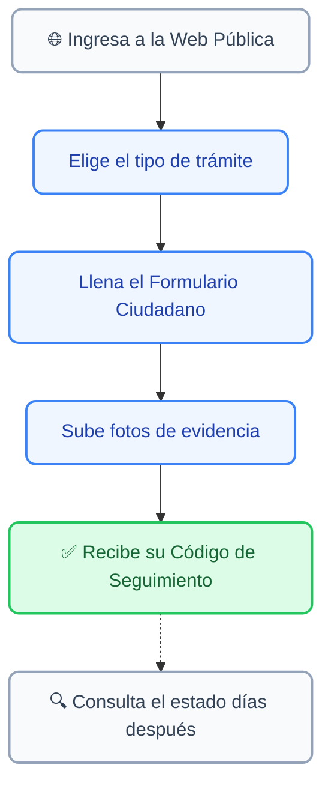
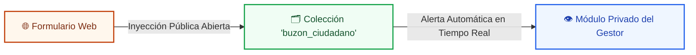

# 📬 Buzón Ciudadano (Portal Público)

El **Buzón Ciudadano** es la cara externa de la plataforma (la página web pública). Es el lugar donde cualquier vecino de la comuna puede ingresar desde su celular o computador para enviarte requerimientos, ideas o agradecimientos sin necesidad de acudir presencialmente a la municipalidad.

---

## 1. 📱 El Viaje del Vecino (¿Cómo funciona?)

Para que puedas guiar a un vecino por teléfono si tiene dudas, aquí tienes el flujo de lo que ellos experimentan en la página web:

---

## 2. 🗂️ Las 4 Puertas de Entrada

Cuando el vecino entra a la web, verá un menú llamado **"Buzón Ciudadano"** con cuatro botones grandes de colores. Dependiendo de lo que elija, el sistema pre-clasificará la intención del ticket:

| Botón en la Web | Color | ¿Para qué lo usan los vecinos? |
| :--- | :---: | :--- |
| **Reportar Problema** | 🟡 Amarillo | Reclamos sobre cosas rotas, microbasurales, luminarias apagadas, baches, etc. |
| **Enviar Iniciativa** | 🟢 Verde | Sugerencias, proyectos comunitarios o ideas para mejorar la comuna. |
| **Agradecimiento** | 🟣 Morado | Mensajes positivos o felicitaciones al equipo territorial. |
| **Otra Consulta** | 🔵 Azul | Dudas generales, preguntas sobre trámites o derivaciones. |

---

## 3. 📝 El Formulario y las Reglas de Evidencia

Al hacer clic en cualquiera de los botones, se abrirá un formulario. Es importante que sepas qué datos se le exigen al vecino para que le expliques si te consulta:

* **Datos Obligatorios:** El sistema le exigirá su Nombre, **RUT** (el sistema le pondrá el guion solo), Teléfono celular (8 dígitos), Asunto y Detalle del problema.
* **Evidencia Fotográfica:** El vecino puede subir fotos del problema (por ejemplo, la foto de un árbol caído). 
  * *Regla Técnica:* El sistema le permite subir hasta **5 fotos** y cada una no puede pesar más de **4MB**. Si te llaman diciendo que "no pueden subir la foto", probablemente excedieron este límite de peso o formato.

> [!TIP]
> **Vinculación Automática:** Si el RUT que ingresa el vecino en el formulario público ya existe en tu Padrón de Vecinos, el sistema amarrará este nuevo ticket a su expediente histórico de forma automática. ¡No tendrás que hacer nada!

---

## 4. 🔍 Transparencia: ¿Cómo consulta el vecino su caso?

El vecino no necesita llamarte para saber si su caso fue derivado. En la misma página web pública, hay una sección a la derecha llamada **"Consulta tu Solicitud"**.

Para revisar en qué va su caso, el vecino debe ingresar dos llaves de seguridad:
1. Su **RUT**.
2. El **Código de Solicitud** (Ej: `SIG-260611-0004`).

Al hacer clic en "Buscar", se abrirá una ventana que le mostrará exactamente el **Estado de Gestión** que tú guardaste en la plataforma (Ej: *"Derivado a DIMAO"* o *"Resuelto"*), junto con la respuesta oficial que redactaste para él.

> [!WARNING]
> **Cuidado con las Notas Internas:** Recuerda que el vecino **SOLO** verá lo que escribas en el cuadro verde de "Respuesta Final al Vecino" al momento de cerrar el caso. Todo lo que escribas en la "Bitácora de Gestión Interna" o "Notas de Resolución" es invisible para él y es de uso exclusivo municipal.

---

## 5. 🛰️ Ruta del Dato: ¿Cómo llega la información a nosotros?

Para garantizar la seguridad de la plataforma, la información que ingresa un vecino desde internet **no se mezcla inmediatamente** con las solicitudes oficiales de la municipalidad. Sigue una ruta protegida en la nube:

1. **El Envío:** Cuando el vecino presiona "Enviar Solicitud", el sitio web genera un documento en una colección aislada de la base de datos llamada `buzon_ciudadano`.
2. **El Contador:** Al mismo tiempo, el sistema consulta el archivo de `counters_diarios` para asignarle al vecino su código público correlativo en la pantalla de éxito.
3. **El Destino:** Como este documento viene de internet sin fiscalización humana, se queda en un "estado flotante" esperando que un Gestor Territorial lo revise, asegurando que ningún dato malicioso afecte los expedientes internos.

---

## 6. 👁️ ¿Cómo lo visualiza el Gestor Territorial?

Como las solicitudes de la web ingresan por un canal independiente, estas **no aparecerán** en tu pestaña normal de *Solicitudes Presenciales*. Para gestionarlas, debes seguir estos pasos:

### 1. El Menú Dedicado
En tu menú lateral izquierdo, ve a la opción **"Buzón Ciudadano"**. Al entrar, verás una tabla con un diseño idéntico al de solicitudes, pero dedicada exclusivamente a lo recolectado por internet.

### 2. Identificación del Requerimiento Nuevo
Todos los ingresos web aterrizarán con una etiqueta de color **Rojo Alerta** que dice **"Por Clasificar"**. Esto te indica que es un texto en crudo enviado por un ciudadano que requiere tu revisión.

### 3. El Proceso de Triage y Adopción
Al hacer clic sobre el requerimiento del vecino, verás los datos que él escribió. Tu trabajo consiste en transformarlo en un caso oficial siguiendo estos pasos:
* **Paso A (Verificar Identidad):** El sistema te mostrará el RUT que digitó el vecino. Verás un indicador automático:
  * Si dice `✓ Vecino Registrado`, el sistema ya vinculó el caso a su ficha.
  * Si dice `✗ No Registrado`, significa que el vecino no está en el padrón. Verás un botón para crearle su ficha en dos clics.
* **Paso B (Asignar Jurisdicción):** Lee la descripción que escribió el ciudadano. En tu panel de gestión, selecciona la **Categoría de Área** y el **Asunto Específico** reales del municipio. Al hacerlo, el sistema auto-asignará el departamento encargado (Ej: *DIMAO* o *DOM*).
* **Paso C (Despacho Oficial):** Haz clic en el botón **"Reclasificar / Despachar requerimiento"**. En ese instante, el documento se moverá físicamente a la colección de `solicitudes` oficiales, cambiará su estado a **"Derivado"** (Azul) y se le notificará al departamento. 

A partir de ese momento, el vecino podrá empezar a ver el avance de su caso en vivo desde el portal público.