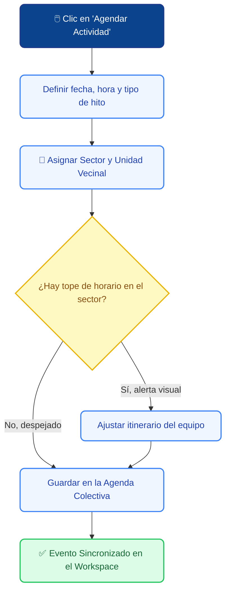

# 📅 Agenda y Calendario Territorial

El módulo de **Agenda y Calendario** es la bitácora de vuelo del equipo. Su propósito es centralizar la planificación de todas las actividades en terreno, asambleas vecinales, operativos comunitarios e hitos institucionales de la concejalía, asegurando que todo el personal operativo esté coordinado en tiempo real.

---

## 1. 🔄 El Flujo de Coordinación de Agenda

Para evitar que dos gestores programen actividades a la misma hora en la misma Unidad Vecinal, el calendario funciona bajo un modelo colaborativo transparente:

---

## 2. 📝 ¿Cómo agendar un hito o reunión en terreno?

Como Gestor Territorial, una de tus tareas principales es asistir a asambleas y coordinar operativos. Cada vez que agendes un compromiso, debes registrarlo siguiendo estos pasos:

1. Ve al menú lateral izquierdo y selecciona **Calendario**.
2. Puedes hacer clic directamente en el día del calendario o presionar el acceso rápido **"Agendar Actividad"** en el Dashboard.
3. Completa el formulario con los siguientes datos mandatorios:

| ✏️ Campo | ¿Para qué sirve? |
| :--- | :--- |
| **Título del Evento** | Nombre claro de la actividad (Ej: *"Asamblea Extraordinaria JJ.VV. Lo Ovalle"*). |
| **Tipo de Actividad** | Clasifica el hito (Asamblea, Operativo en Terreno, Reunión Interna, Audiencia). |
| **Fecha y Horario** | Define el inicio y el término estimado del compromiso. |
| **📍 Sector y Dirección** | Indica en qué sector se realizará. Esto ayuda a pintar los mapas de calor territoriales. |
| **Organización Vinculada** | Si la reunión es con un club de adulto mayor o comité de seguridad, asócialo aquí para que quede guardado en su historial. |

4. Presiona **"Guardar Actividad"**. El evento se pintará inmediatamente en el calendario de todo el equipo.

---

## 3. 🎨 Clasificación por Colores (Tipos de Hitos)

El calendario utiliza un código de colores automático para que, de un solo vistazo mensual, sepas qué tipo de despliegue predomina en la semana:

* 🔵 **Azul (Asambleas Vecinales):** Reuniones formales con directivas, juntas de vecinos o comités de adelanto.
* 🟢 **Verde (Operativos Comunitarios):** Hitos masivos de terreno, como operativos oftalmológicos, veterinarios o entrega de ayudas.
* 🟡 **Amarillo (Audiencias y Casos 1:1):** Citas privadas del Concejal con vecinos específicos para revisar expedientes críticos.
* 🟣 **Morado (Reuniones Internas / Concejo):** Hitos administrativos del equipo o sesiones oficiales del Concejo Municipal.

---

## 4. 🚨 Bloqueos y Buenas Prácticas de Agenda

Para garantizar la armonía en los despliegues de campo, ten en cuenta las siguientes reglas inteligentes del sistema:

> [!TIP]
> **🔗 El poder de la vinculación:**
> Al agendar una actividad, si vinculas el nombre exacto de una Organización Comunitaria registrada, la asamblea aparecerá reflejada dentro de la pestaña "Actividades" en las fichas de todos los vecinos que pertenezcan a esa misma organización.

> [!WARNING]
> **🛡️ Inmutabilidad de Hitos Pasados:**
> Una vez que una actividad ha ocurrido y su fecha queda en el pasado, el sistema **bloquea su edición** para los Gestores Territoriales. Esto se hace para evitar la alteración de las bitácoras históricas de terreno. Si necesitas corregir un dato de un evento pasado, solicita el cambio a tu Jefatura (Administrador).