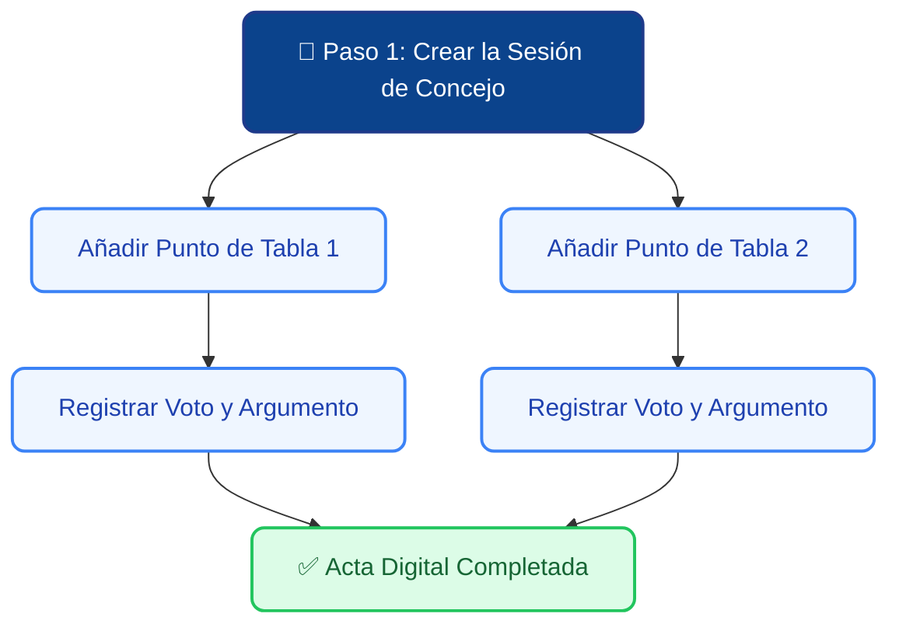

# 🏛️ Actas y Concejo Municipal

El módulo de **Concejo Municipal** es el archivo histórico y transparente de las decisiones tomadas por las autoridades. Aquí podrás registrar cada sesión que se realiza en la municipalidad, detallar los temas discutidos y guardar un registro exacto de cómo votó el Concejal en cada punto.

---

## 1. 🧠 Concepto Clave: Sesión vs. Puntos de Tabla

Para mantener el orden perfecto, el sistema divide el trabajo en dos niveles lógicos (imagina que es como una carpeta y sus documentos adentro):

* 📁 **La Sesión de Concejo (El Contenedor):** Es la reunión en sí misma. Por ejemplo: *"Sesión Ordinaria N° 14 del día martes"*.
* 📄 **Los Puntos de Votación (El Contenido):** Son los temas específicos que se discutieron y votaron *dentro* de esa sesión. Por ejemplo: *"Aprobación del presupuesto de salud"* o *"Rechazo a patente de alcoholes"*.

**Regla de oro:** Siempre debes crear primero la **Sesión**, y luego ingresar los **Puntos** dentro de ella.

### 🗺️ Flujo Visual del Concejo

---

## 2. 📅 Paso 1: ¿Cómo crear una Sesión de Concejo?

1. En el menú lateral izquierdo de tu plataforma, haz clic en **Concejo Municipal**.
2. Arriba a la derecha, haz clic en el botón azul **"+ Nueva Sesión"**.
3. Completa los datos generales de la reunión prestando atención a estos campos:

| ✏️ Campo | ¿Qué debes ingresar? |
| :--- | :--- |
| **Tipo de Sesión** | Selecciona si es una sesión **Ordinaria** (las de rutina semanal) o **Extraordinaria** (citada por urgencia). |
| **Número de Sesión** | El folio oficial de la municipalidad (Ej: *Sesión N° 45*). |
| **Fecha** | El día exacto en que se llevó a cabo el concejo. |
| **Enlace de Transmisión** | *(Opcional)* Si la municipalidad transmitió el concejo por YouTube o Facebook, pega el link aquí para tener el archivo en video a mano. |

4. Presiona **Guardar Sesión**. Ahora la "carpeta" aparecerá en tu tabla principal.

---

## 3. ⚖️ Paso 2: Agregar Puntos de Tabla y Votaciones

Una vez que la Sesión está creada en la tabla, debes ingresar qué temas se hablaron y cómo votó tu autoridad.

1. Haz clic sobre la **Sesión** en la tabla principal para abrir su panel de detalles (a la derecha).
2. Busca la sección de **"Puntos de Tabla"** y presiona **"+ Agregar Votación"**.
3. Completa la información específica de ese tema:

| ✏️ Campo | ¿Para qué sirve? |
| :--- | :--- |
| **Materia / Tema** | El título corto del punto discutido (Ej: *"Modificación presupuestaria DOM"*). |
| **Postura de la Autoridad** | Registra cómo votó tu equipo/concejal: **A Favor**, **En Contra**, **Abstención** o **Ausente**. |
| **Argumento / Nota Interna** | Un espacio clave para justificar el voto. (Ej: *"Se vota en contra porque el presupuesto presentado por el alcalde no detalla los gastos operativos de los camiones"*). |
| **Resultado Final** | Indica si el punto fue finalmente Aprobado o Rechazado por la mayoría del concejo. |

4. Guarda el punto. Repite este proceso por cada tema que se haya discutido en esa sesión.

---

## 4. 📊 Transparencia y Búsqueda Histórica

> [!TIP]
> **Buscador Inteligente:**
> Si un vecino o dirigente te pregunta meses después *"¿Por qué el concejal rechazó la patente de la botillería de mi barrio?"*, no necesitas revisar horas de videos en YouTube. Simplemente usa la **Barra de Búsqueda** en este módulo, escribe "botillería" y el sistema te filtrará exactamente en qué sesión se discutió y cuáles fueron los argumentos que tú mismo guardaste.

> [!WARNING]
> **Restricción de Permisos de Edición:**
> Por reglas de seguridad del sistema, los *Gestores Territoriales* y *Secretarias* pueden consultar y leer las actas para dar respuestas a la comunidad, pero la edición o eliminación de sesiones y votos suele estar reservada exclusivamente para el **Administrador** o la propia autoridad. Esto garantiza que la memoria política del equipo no sufra modificaciones accidentales.