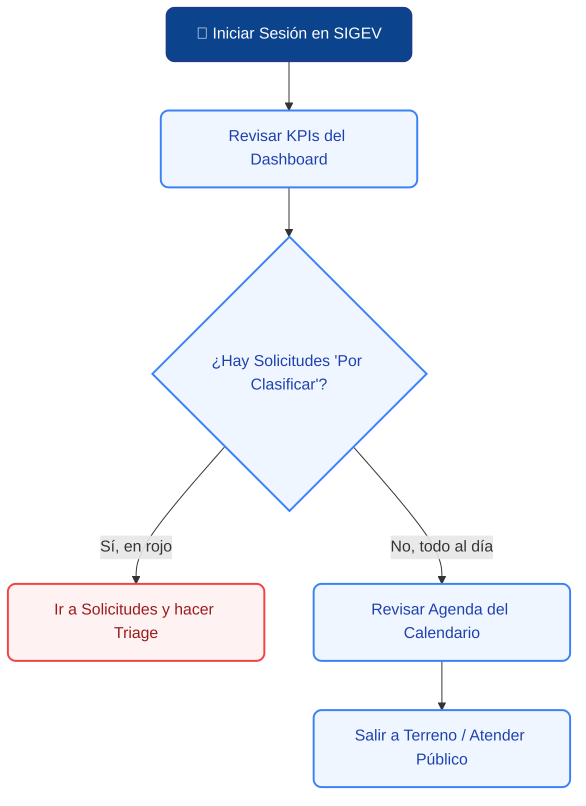

# 🎛️ Dashboard Principal (Tu Centro de Comando)

El **Dashboard** es la primera pantalla que verás cada vez que inicies sesión en SIGEV. Está diseñado para ser tu "Centro de Comando Diario", dándote un resumen rápido de cómo está la comuna hoy y ayudándote a comenzar tu trabajo de inmediato, sin dar rodeos.

---

## 1. ☕ Tu Rutina Diaria (Flujo Recomendado)

Para sacarle el máximo provecho a tu jornada, te recomendamos seguir este flujo visual apenas ingreses a la plataforma:

---

## 2. 📊 Resumen del Workspace (Tus Indicadores)

En la parte superior de la pantalla, verás tarjetas con números grandes. Estas tarjetas son tus **indicadores de control diario**. El sistema te muestra exactamente lo que necesitas atender:

| 🏷️ Tarjeta | ¿Qué significa? | ¿Qué acción debes tomar? |
| :--- | :--- | :--- |
| **👥 Vecinos Registrados** | Muestra el total de personas en el padrón y cuántos vecinos nuevos se sumaron hoy. | Celebra el crecimiento. Si el número de hoy es bajo, ¡es un buen día para salir a enrolar en terreno! |
| **📞 Contactabilidad** | Porcentaje de vecinos que tienen un teléfono válido o correo electrónico anotado. | Trata de mantener este porcentaje alto. Si falta el teléfono, pídeselo al vecino la próxima vez que lo veas. |
| **📍 Georreferenciados** | Indica cuántos de tus vecinos ya tienen su casa ubicada exactamente en el mapa satelital. | Si el número está en rojo, significa que hay expedientes sin dirección. ¡Revisa el Padrón para actualizarlos! |

---

## 3. ⚡ Accesos Rápidos y Creación Ágil

El Dashboard está pensado para ahorrarte clics. No necesitas navegar por menús complejos si ocurre una urgencia en la oficina. Encontrarás botones de acción rápida para:

* **➕ Nuevo Vecino:** Te lleva directo al formulario para enrolar a un ciudadano en el sistema.
* **📝 Nueva Solicitud:** Abre la ventana para crear un ticket de reclamo o ayuda social (si el vecino está presencialmente contigo).
* **📅 Agendar Actividad:** Te permite anotar rápidamente una asamblea o reunión en el calendario colectivo del equipo.

---

> [!NOTE]
> **🛡️ Tu vista está optimizada (Sin distracciones):**
> Notarás que en tu Dashboard no hay gráficos financieros complejos, botones de exportar a Excel, ni herramientas de configuración del servidor. ¡No es un error! Al tener el rol de **Gestor Territorial**, la plataforma oculta automáticamente la información estratégica sensible (reservada para la Jefatura o el Administrador) para que tu pantalla sea rápida, limpia y 100% enfocada en atender a la comunidad.