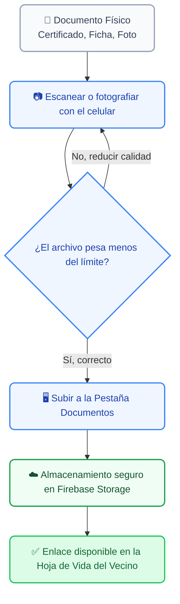

# 📂 Centro Documental y Gestión de Archivos

El **Centro Documental** de SIGEV es el espacio encargado de digitalizar y resguardar el respaldo legal y visual de la comuna. No funciona como una carpeta aislada, sino como un sistema inteligente **embebido dentro de cada ficha de vecino y cada ticket de solicitud**, permitiendo asociar archivos PDF o imágenes directamente a un RUN o a un Folio oficial.

---

## 1. 🔄 El Flujo Digital del Documento

Para mantener la base de datos optimizada y evitar que la plataforma se sature con archivos demasiado pesados, el proceso de digitalización sigue un estándar estricto:

---

## 2. 👤 Archivos en la Ficha del Vecino (Respaldo Social)

Cuando estás editando el perfil de un ciudadano en el **Formulario Avanzado**, la última pestaña se llama **Documentos**. Este espacio está reservado para subir archivos de larga duración que validen la situación del vecino (Ej: *Certificado de Residencia, Ficha Registro Social de Hogares o credenciales de discapacidad*).

### 🛠️ Reglas de Carga para Fichas de Vecinos:
| Propiedad | Regla del Sistema | ¿Por qué es así? |
| :--- | :--- | :--- |
| **Formatos Permitidos** | `PDF`, `JPG`, `PNG` | Asegura que cualquier computador o celular del equipo pueda abrir el archivo sin instalar programas extra. |
| **Peso Máximo** | **Hasta 10 MB** por archivo | Límite amplio pensado para escanear documentos de muchas páginas (como informes sociales completos). |
| **Visibilidad** | Pestaña "Documentos" del Visor | Cualquier gestor que abra el expediente del vecino verá el botón **"Ver Archivo"** para abrir el documento original en una pestaña nueva. |

---

## 3. 📸 Adjuntar Evidencia en Solicitudes (Tickets)

A diferencia de los documentos de los vecinos, la evidencia en las **Solicitudes** (tickets de terreno) se compone principalmente de fotografías tomadas en el momento del hallazgo (Ej: *un árbol caído, una luminaria rota o una filtración de agua*).

Tanto en el **Buzón Ciudadano público** como en tu panel de **Nueva Solicitud**, encontrarás el botón **"Adjuntar Evidencia"**.

### 🚨 Restricciones Críticas de Evidencia:
> [!WARNING]
> **Tope de Archivos:** El sistema permite subir un **máximo de 5 fotos** por solicitud.
> **Tope de Peso:** Cada imagen individual no puede pesar más de **4 MB**. Si intentas subir una foto en ultra-alta resolución que supere este peso, la plataforma bloqueará el envío y te mostrará un mensaje de advertencia.

---

## 4. 🛡️ Seguridad, Privacidad y Buenas Prácticas

Como Gestor Territorial, manejas información altamente sensible de las familias de la comuna. Es obligatorio cumplir con las siguientes directrices:

> [!NOTE]
> **Privacidad de los Datos:**
> Los documentos que subes quedan alojados en un servidor encriptado (`Firebase Storage`). Las Reglas de Seguridad impiden que personas ajenas a la municipalidad puedan adivinar o acceder a los enlaces de los archivos adjuntos.

> [!TIP]
> **¿Cómo escanear con el celular?**
> Si estás en terreno y el vecino te entrega un documento en papel, no le tomes una foto normal con la cámara. Utiliza aplicaciones de escaneo (como *CamScanner* o la app nativa de *Notas* de tu celular) en modo **"Blanco y Negro"** o **"Documento"**. Esto convertirá el papel en un archivo PDF limpio, legible y que pesará menos de 1 MB, facilitando una carga instantánea en el sistema.

> [!WARNING]
> **Prohibición de Eliminación:**
> Los Gestores Territoriales tienen permitido **subir y consultar** documentos, pero **no pueden eliminarlos** para evitar pérdidas accidentales de historial legal. Si subiste un documento equivocado a la ficha de un vecino, deberás solicitar la corrección al **Super Administrador** del sistema para que libere el espacio.