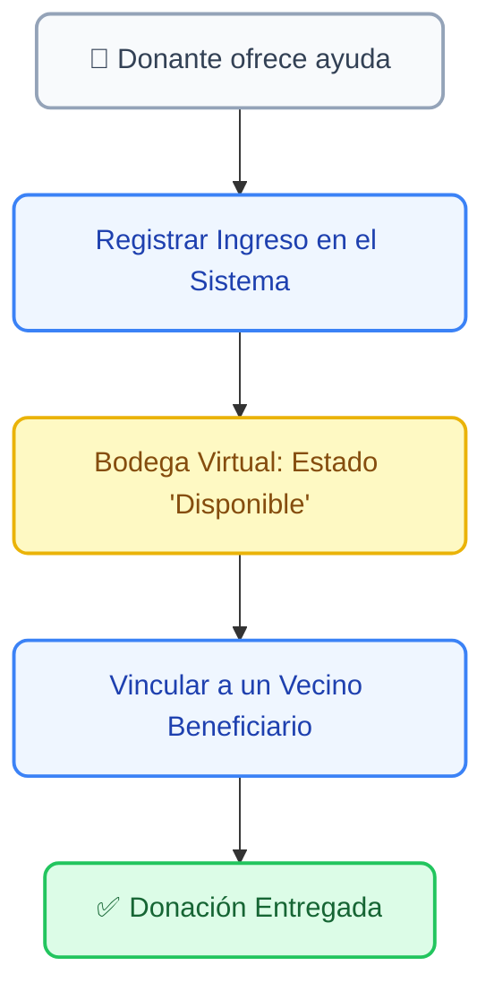

# 💖 Gestión de Donaciones y Ayudas

El módulo de **Donaciones** es tu libro de inventario social. Te permite registrar cualquier aporte o ayuda material que reciba la concejalía (ya sea de privados, empresas o la propia municipalidad) y trazar exactamente a qué vecino beneficiario se le entregó, garantizando 100% de transparencia.

---

## 1. 📦 El Flujo de una Donación

Para mantener el orden en la bodega y en los registros, el sistema maneja las donaciones en dos etapas muy simples: **El Ingreso** y **La Entrega**.

---

## 2. 📥 ¿Cómo registrar una nueva Donación (Ingreso)?

Cuando llega una caja de mercadería, una cama clínica o cualquier ayuda a la oficina, debes ingresarla al sistema de inmediato para que quede en el inventario.

1. Ve al menú lateral izquierdo y haz clic en **Donaciones**.
2. Arriba a la derecha, presiona el botón azul **"+ Nueva Donación"**.
3. Completa el formulario de registro prestando atención a estos campos:

| ✏️ Campo | ¿Para qué sirve? |
| :--- | :--- |
| **Tipo de Ayuda** | Categoriza lo que recibes (Ej: Alimentos, Insumos Médicos, Material de Construcción, Ropa). |
| **Descripción y Cantidad** | Sé específico. (Ej: *"2 Cajas de mercadería no perecible"* o *"1 Silla de ruedas estándar"*). |
| **Datos del Donante** | Registra quién hizo el aporte. Puede ser una empresa, una junta de vecinos, o incluso donaciones anónimas. |
| **Estado Inicial** | Déjalo siempre en **"Disponible"** si el artículo se guardará en la oficina para una futura entrega. |

4. Haz clic en **Guardar**. La donación aparecerá en tu tabla principal.

> [!TIP]
> **Campañas Específicas:** Si la donación es parte de una campaña (Ej: *Campaña de Invierno* o *Navidad*), asegúrate de anotarlo en las "Notas Internas". Esto ayudará al Concejal a sacar reportes de cuánto se recolectó por campaña.

---

## 3. 🤝 ¿Cómo entregar la donación a un Vecino?

Tener las cosas en estado *"Disponible"* significa que están ocupando espacio. Cuando decides a qué vecino vulnerable se le entregará la ayuda, debes actualizar el registro:

1. Busca la donación en la tabla principal y haz clic en ella para abrir su panel de edición.
2. Cambia el Estado de *"Disponible"* a **"Entregado"**.
3. Al hacer esto, el sistema te habilitará la sección de **Datos del Beneficiario**.
4. **Vincular al Padrón:** Escribe el RUT o Nombre del vecino que recibe la ayuda. El sistema lo buscará en tu **Padrón de Vecinos** y amarrará esta donación a su expediente digital.
5. Anota la fecha exacta de entrega y guarda los cambios.

> [!WARNING]
> **Transparencia Total:** Una vez que marcas una donación como "Entregada" y la vinculas a un RUT, este registro es inborrable para los Gestores Territoriales. El sistema creará una línea de tiempo (Log) que indicará qué día y qué funcionario hizo la entrega.

---

## 4. 🚥 Semáforo de Inventario

En la tabla principal de Donaciones, guíate siempre por los colores de estado:

* 🟢 **Disponible (Verde):** El artículo está guardado en la oficina o bodega, listo para ser asignado a alguien que lo necesite.
* 🔵 **Asignado (Azul):** Ya sabes a quién se lo vas a dar, pero aún no lo vienen a buscar o no lo has ido a dejar a su casa.
* ⚪ **Entregado (Gris/Inactivo):** El ciclo terminó. El vecino ya tiene la ayuda en sus manos.