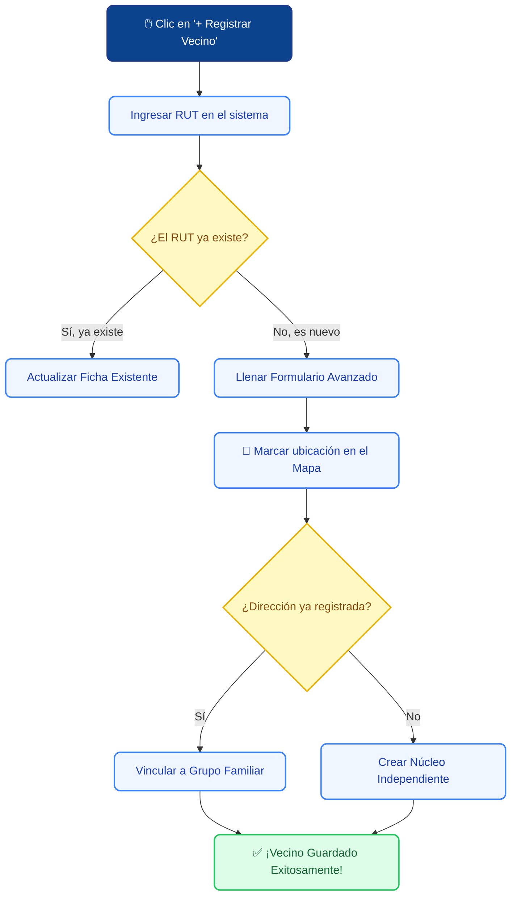

# 👥 Padrón de Vecinos

El **Padrón de Vecinos** es tu agenda principal de trabajo territorial. Aquí podrás registrar a los ciudadanos de tu comuna, ver su historial de solicitudes (tickets) y ubicarlos rápidamente en el mapa comunal.

---

## 1. 📝 El Proceso de Registro (Paso a Paso)

Para evitar duplicados y mantener la base de datos limpia, SIGEV utiliza un sistema inteligente de registro. Antes de ver el detalle de los campos, aquí tienes un resumen visual de cómo funciona el proceso:

### 🗺️ Flujo Visual de Registro

### Paso 1: Validación de Identidad
Para comenzar, haz clic en el botón azul **"+ Registrar Vecino"** (arriba a la derecha). Se abrirá una pequeña ventana pidiéndote el **RUT del Vecino**.
1. Escribe el RUT (el sistema le pondrá los puntos y guion automáticamente).
2. Si el vecino **ya existe**, el sistema te avisará y abrirá su ficha para que la actualices.
3. Si el vecino **es nuevo**, el botón se habilitará para llevarte al Formulario Avanzado.

---

### Paso 2: Formulario de Registro Avanzado
Aquí es donde llenas el expediente del ciudadano. Para hacértelo más fácil, el formulario está dividido en "Cajas" de colores por temáticas:

#### 👤 Bloque 1: Identidad y Contacto
| ✏️ Campo | ¿Obligatorio? | ¿Qué debes ingresar? |
| :--- | :---: | :--- |
| **Nombre Completo** | Sí 🔴 | Nombre y apellidos del vecino. |
| **Teléfono Celular** | No ⚪ | Escribe solo los 8 dígitos (ej: 12345678). El `+56 9` ya está puesto. |
| **Fecha de Nacimiento** | No ⚪ | Permite al sistema calcular el rango etario para campañas. |
| **Sexo y Canal Preferido** | Sí 🔴 | Selecciona si prefiere ser contactado por WhatsApp, Llamada o Correo. |

#### 🏥 Bloque 2: Salud y Participación Social (Cajas Verde y Azul)
| ✏️ Campo | ¿Obligatorio? | ¿Qué debes ingresar? |
| :--- | :---: | :--- |
| **Previsión de Salud** | No ⚪ | Elige entre FONASA, ISAPRE, DIPRECA, etc. Puedes poner su Tramo (A, B, C...). |
| **Tipo de Solicitante** | Sí 🔴 | Por defecto es "Vecino/a". Si es un dirigente, cambia a "Organización Comunitaria" y se abrirán nuevos campos para poner el nombre de su Junta o Club. |
| **Grupo Familiar** | No ⚪ | Indica cuántas personas viven en la casa y marca la casilla si es el Jefe/a de Hogar. |

#### 📍 Bloque 3: Ubicación Geográfica (¡El más importante!)
Este bloque permite ubicar al vecino en el mapa satelital sin tener que adivinar sus coordenadas.

1. **Dirección Principal:** Escribe la calle y el número (Ej: *Av. Principal 1234*).
2. **Dirección Complementaria:** Usa esto para departamentos (Ej: *Block 4, Depto 201*).
3. **🗺️ El Mapa Interactivo:** ¡Haz clic sobre el mapa! Verás que aparece un marcador azul. El sistema leerá ese punto y rellenará **automáticamente** a qué Sector Territorial pertenece esa calle.
4. **Unidad Vecinal y Junta:** Al detectarse el sector, podrás elegir de la lista desplegable la UV y la Junta de Vecinos exacta.

Haz clic en el botón azul **"Guardar Vecino"** al final de la página para finalizar.

---

## 2. 🚨 Alertas Inteligentes del Sistema

Al intentar guardar a un vecino, la plataforma te cuida las espaldas para que no cometas errores de digitación. Puedes toparte con dos pantallas de aviso:

> [!WARNING]
> **👻 Alerta de Perfil Duplicado (Fantasma):**
> Si estás ingresando a un vecino nuevo, pero el sistema detecta que ese **Nombre** o **Teléfono** ya existe en otro expediente antiguo que no tenía RUT, bloqueará el guardado. Te pedirá que busques a ese vecino antiguo y le actualices el RUT en lugar de crear uno doble.

> [!TIP]
> **🏠 Escudo de Cruce Familiar:**
> Si escribes una dirección exacta donde ya vive otra persona (ej: *Goycolea 405*), saltará una alerta amable. Te preguntará si este nuevo vecino es familiar de los que ya viven ahí. Si dices **"Sí, Amarrar"**, los agrupará en el mismo Hogar. Si dices **"No"**, lo creará como un inquilino independiente (útil para condominios o arriendos).

---

## 3. 🔍 Buscar y Leer el Expediente

Si necesitas buscar a alguien rápido en la tabla principal:

1. Usa la **Barra de Búsqueda** y escribe su RUT, Nombre o Teléfono.
2. Haz clic en la fila del vecino para abrir su **Resumen Rápido (Panel Derecho)**. Ahí verás sus métricas de participación y su foto.
3. Si quieres ver todos los detalles, haz clic abajo en **"Ver expediente completo →"**. 
4. Esto abrirá su **Hoja de Vida**, donde verás:
   * Sus solicitudes históricas.
   * Su núcleo familiar completo.
   * Su ubicación georreferenciada.

> [!NOTE]
> En la tabla principal, fíjate en la columna **"Última Interacción"**. Un puntito **Verde** indica que el vecino se contactó recientemente, mientras que un texto gris de "Sin actividad" significa que nunca ha ingresado un ticket formal.

---

## 4. 🎛️ Filtros Rápidos (Segmenta a tu comunidad)

Justo arriba de la tabla de vecinos, verás una botonera con "Chips" (botones grises redondeados) y selectores. Estos te permiten filtrar el padrón en un solo clic:

* **Con solicitudes abiertas:** Te muestra únicamente a los vecinos que tienen casos o tickets pendientes de resolución.
* **👨‍👩‍👧‍👦 Núcleos Familiares:** Filtra la lista para mostrarte solo a personas que comparten domicilio con alguien más (Hogares).
* **🏠 Sin Dirección / Pendientes de Mapeo:** Crucial para identificar a los vecinos que fueron subidos mediante Excel y a los que todavía les falta asignarles una calle en el mapa.
* **Selector de Sector:** Un menú desplegable para aislar la vista y trabajar exclusivamente con los vecinos del *Sector 1*, *Sector 2*, etc.

> [!TIP]
> **Copiar ID Rápido:** Cuando abres el panel derecho de un vecino, verás un código como `SIG-VEC-00123` y un icono de copiar 📋. Haz clic ahí para copiar el código al portapapeles. ¡Es súper útil para pegarlo en informes o enviarlo por chat a tus colegas!

---

## 5. 📊 Pestaña de Métricas y Análisis

Tu padrón no es solo una lista, también es un centro de inteligencia. Justo debajo de los cuatro cuadros numéricos superiores, verás dos pestañas principales: **"Directorio de Vecinos"** y **"Métricas y Análisis"**.

Haz clic en **Métricas y Análisis** para cambiar la vista de la tabla a un panel de gráficos automáticos que se calculan en tiempo real:

* **Distribución por Sector:** Un gráfico de barras para saber qué sector territorial concentra más personas.
* **Vecinos por Estado:** Un gráfico circular ("Donut") que te dice el porcentaje de vecinos Activos, Medios o Inactivos.
* **Rango Etario y Género:** Ideal para planificar campañas de salud o talleres, ya que te muestra de un vistazo cuántos adultos mayores, jóvenes, hombres y mujeres hay en el registro.