# 🗺️ Mapa Territorial Inteligente e Índices GIS

El módulo `mapa.js` transforma datos tubulares y aburridos en inteligencia geoespacial. Utiliza la librería **Leaflet JS** montada sobre **OpenStreetMap** para renderizar, en tiempo real, la ubicación del padrón vecinal, las solicitudes de terreno y los aportes sociales, permitiendo a la autoridad detectar focos de conflicto visualmente.

---

## 1. Diagrama de Flujo: Arquitectura Cartográfica
Azul = requerido · Gris = opcional · Verde = validación exitosa · Rojo = bloqueo de seguridad

```mermaid
graph TD
    %% Estilos corporativos SIGEV
    classDef azul fill:#eff6ff,stroke:#bfdbfe,stroke-width:2px,color:#0f172a;
    classDef gris fill:#f8fafc,stroke:#e2e8f0,stroke-width:2px,color:#475569;
    classDef verde fill:#f0fdf4,stroke:#bbf7d0,stroke-width:2px,color:#14532d;
    classDef rojo fill:#fef2f2,stroke:#fecaca,stroke-width:2px,color:#991b1b;

    subgraph Extraccion [Extracción y Memoria]
        A("<div style='width: 280px; text-align: center; padding: 5px;'><b>Carga Paralela NoSQL</b><br><span style='font-size: 13px; font-weight: normal; color: #475569;'>Promise.all&#40;&#41; de 4 colecciones</span></div>"):::gris
        B("<div style='width: 280px; text-align: center; padding: 5px;'><b>Limpieza y Cruce RUT</b><br><span style='font-size: 13px; font-weight: normal; color: #1e40af;'>Indexación de datos aislados</span></div>"):::azul
    end

    subgraph Capas [Renderizado de Capas]
        C("<div style='width: 280px; text-align: center; padding: 5px;'><b>Capa 1: Padrón y Vecinos</b><br><span style='font-size: 13px; font-weight: normal; color: #1e40af;'>Pines Azules vectoriales</span></div>"):::azul
        D("<div style='width: 280px; text-align: center; padding: 5px;'><b>Capa 2: Conflictos</b><br><span style='font-size: 13px; font-weight: normal; color: #991b1b;'>Pines Rojos y Celestes</span></div>"):::rojo
        E("<div style='width: 280px; text-align: center; padding: 5px;'><b>Capa 3: Cobertura Social</b><br><span style='font-size: 13px; font-weight: normal; color: #14532d;'>Pines Verdes de Donaciones</span></div>"):::verde
        F("<div style='width: 280px; text-align: center; padding: 5px;'><b>Capa 4: Hotspots</b><br><span style='font-size: 13px; font-weight: normal; color: #475569;'>Círculos de calor dinámicos</span></div>"):::gris
    end

    subgraph Visualizacion [Experiencia de Usuario]
        G("<div style='width: 280px; text-align: center; padding: 5px;'><b>Controlador de Vista</b><br><span style='font-size: 13px; font-weight: normal; color: #1e40af;'>Activa/Desactiva Capas &#40;Checkboxes&#41;</span></div>"):::azul
        H("<div style='width: 280px; text-align: center; padding: 5px;'><b>Inyección en Leaflet JS</b><br><span style='font-size: 13px; font-weight: normal; color: #14532d;'>mapaInstancia.addLayer&#40;&#41;</span></div>"):::verde
    end

    %% Fondos transparentes
    style Extraccion fill:transparent,stroke:none,color:#0f172a,font-weight:bold,font-size:15px;
    style Capas fill:transparent,stroke:none,color:#0f172a,font-weight:bold,font-size:15px;
    style Visualizacion fill:transparent,stroke:none,color:#0f172a,font-weight:bold,font-size:15px;

    %% Conexiones
    A --> B
    B --> C
    B --> D
    B --> E
    B --> F
    C --> G
    D --> G
    E --> G
    F --> G
    G --> H
```

---

## 2. Inyección Vectorial de Rendimiento (SVG Pines)

Tradicionalmente, cargar miles de marcas geográficas en un mapa provocaría el colapso de la memoria RAM del navegador al tener que renderizar pesados archivos de imagen externos (`.png`). Para solucionar este cuello de botella (Performance UI), SIGEV no utiliza archivos binarios externos:
* El motor define constantes estáticas en texto plano (`PIN_AZUL`, `PIN_ROJO`, `PIN_CELESTE`, `PIN_VERDE`) que contienen el código vectorial `<svg>` puro y optimizado.
* Leaflet transforma estas strings matemáticas directamente en gráficos interactivos ligeros mediante el método `L.divIcon`. Esto permite una fluidez absoluta al hacer *Zoom* o arrastrar el mapa de forma agresiva.

---

## 3. Algoritmo de Detección de Focos de Alerta (Hotspots)

El mapa no es solo un visualizador estático, sino una herramienta analítica activa. El sistema construye dinámicamente la variable `matrizColisionesHotspots` en la memoria del cliente:

1. **Agrupación Coordenada:** Redondea la latitud y longitud a 4 decimales fijos (`toFixed(4)`) para agrupar de forma matemática todos los reclamos e ingresos que ocurran en un radio aproximado de ~10 metros (Ej: generando una llave de texto como `"-33.5372|-70.6644"`).
2. **Conteo de Incidencias:** Si dos o más solicitudes o reclamos (`Buzón Ciudadano` y `Requerimientos Presenciales`) colisionan bajo la misma llave geográfica, el sistema levanta una bandera de calor.
3. **Burbujas Dinámicas:** Por cada punto crítico consolidado, Leaflet dibuja un círculo de fuego (`L.circle`) color naranja, incrementando su radio en el mapa en tiempo real a razón matemática de `25 + (totalTickets * 4)`. A mayor volumen de quejas en una misma esquina, más grande la mancha de alerta en la pantalla.

---

## 4. Fichas de Cobertura y Anclas Geométricas

El módulo calcula un indicador de gestión crucial denominado **Tasa de Participación o Cooperación Comunal** (Solicitudes / Vecinos = % Participación) y lo expone flotando directamente sobre el mapa.

> [!NOTE]
> **📐 Matriz de Anclaje Cartográfico (`sectoresGeometriaData`)**
> Como los sectores son polígonos irregulares, el mapa no puede adivinar dónde renderizar las tarjetas. SIGEV utiliza una matriz de "Centros de Gravedad" pre-calculados (Latitud y Longitud) para anclar de forma perfecta los *popups* estadísticos sin que se superpongan:

| Etiqueta UI | Sector Cartográfico | Centro Geométrico Anclado |
| :--- | :--- | :--- |
| `SECTOR 1 (NORESTE)` | Sector Territorial 1 | `[-33.5218, -70.6531]` |
| `SECTOR 2 (CENTRO-ESTE)` | Sector Territorial 2 | `[-33.5332, -70.6558]` |
| `SECTOR 3 (CENTRO-SUR)` | Sector Territorial 3 | `[-33.5429, -70.6606]` |
| `SECTOR 4 (NORTE)` | Sector Territorial 4 | `[-33.5186, -70.6666]` |
| `SECTOR 5 (SUR)` | Sector Territorial 5 | `[-33.5292, -70.6708]` |
| `SECTOR 6 (ORIENTE)` | Sector Territorial 6 | `[-33.5386, -70.6748]` |

Mediante la clase `leaflet-sector-card-container`, estos letreros se montan de manera limpia sobre estos centros geográficos, permitiendo una lectura macro de la comuna con un solo vistazo.

---

## 5. Cuadrantes Comunales y Polígonos de Delimitación

La concejalía fragmenta el territorio comunal en 6 Sectores Territoriales definidos en una matriz. El sistema dibuja de forma fija las fronteras e introduce líneas divisorias sólidas y segmentadas (`dashArray: '6, 9'`) para reflejar los ejes viales estructurantes, inyectando una opacidad del 25% (`fillOpacity: 0.25`) para no tapar la cartografía urbana base.

---

## 6. Controladores UI y Optimización Responsive

El archivo `mapa.css` e `html` resguardan la experiencia visual implementando un diseño altamente resistente:

* **Control Maestro del Viewport (`invalidateSize`):** El gran defecto nativo de Leaflet JS es que, si el mapa se dibuja dentro de un contenedor escondido (`display: none`), sus dimensiones colapsan a 0 píxeles. El controlador inyecta retrasos controlados mediante `setTimeout(() => mapaInstancia.invalidateSize(), 60)` y `200ms` al cambiar de pestaña o contraer la leyenda lateral, forzando al navegador a recalcular el tamaño real de la caja geométrica.
* **Smart Toggle (Interruptor Integral):** El botón superior evalúa el conteo de capas encendidas en la memoria RAM del cliente. Si detecta que el mapa está limpio, asume la intención de "Seleccionar Todo", encendiendo las 7 capas en un solo pulso de red sin generar re-lecturas a Cloud Firestore.

---

## 7. Panel Lateral de Glosario y Fronteras Oficiales (Leyenda GIS)

Para asegurar que cualquier operador territorial (independiente de su nivel técnico) pueda auditar el mapa de forma correcta, la interfaz incrusta permanentemente el panel `#panel-info-sectores`.

Este componente desglosa la simbología mediante viñetas CSS y establece por arquitectura los límites viales definitivos de los cuadrantes:

| Cuadrante | Límites Territoriales Oficiales en SIGEV |
| :--- | :--- |
| **Sector 1 (Noreste)** | **N:** Av. Lo Ovalle \| **S:** Av. El Parrón \| **E:** Av. San Francisco \| **O:** Gran Avenida |
| **Sector 2 (Centro-Este)** | **N:** Av. El Parrón \| **S:** Av. Américo Vespucio Sur \| **E:** Av. San Francisco \| **O:** Gran Avenida |
| **Sector 3 (Centro-Sur)** | **N:** Av. Américo Vespucio Sur \| **S:** Av. Lo Espejo \| **E:** Av. San Francisco \| **O:** Gran Avenida |
| **Sector 4 (Norte)** | **N:** Av. Lo Ovalle \| **S:** Av. El Parrón \| **E:** Gran Avenida \| **O:** Autopista Central |
| **Sector 5 (Sur)** | **N:** Av. El Parrón \| **S:** Av. Américo Vespucio Sur \| **E:** Gran Avenida \| **O:** Autopista Central |
| **Sector 6 (Oriente)** | **N:** Av. Américo Vespucio Sur \| **S:** Av. Lo Espejo \| **E:** Gran Avenida \| **O:** Autopista Central |

---

## 8. Vista Estadística Aislada (Dashboard Tabular)

El renderizado de mapas interactivos de alto volumen demanda considerables recursos de GPU y procesador. Pensando en dispositivos móviles territoriales de gama baja o usuarios directivos que solo buscan números duros sin interactuar con los pines, el sistema implementa el mecanismo de **Sub-pestañas Mutantes**.

* Al presionar la pestaña `"📊 Fichas de Cobertura"`, el sistema oculta por completo el lienzo cartográfico (`display: none`) para liberar memoria caché y activa el contenedor plano `pane-info-view`.
* El motor invoca la rutina `renderizerFichasCoberturaStandalone()`, la cual clona la metadata del mapa y genera de manera limpia una rejilla adaptativa CSS (`.standalone-sectors-grid`) inyectando tarjetas de cobertura empresarial.
* Estas tarjetas muestran exactamente la misma analítica (Cantidad de Vecinos, Solicitudes Consolidadas y Tasa de Cooperación), pero en un formato plano, ordenado, libre de mapas y de carga ultra instantánea.