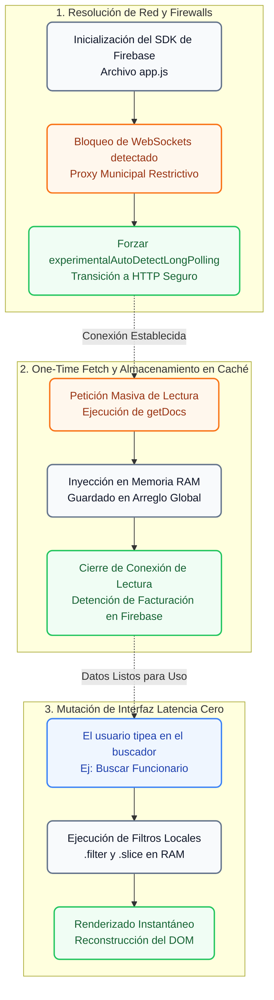

# 🔄 Estrategia de Sincronización y Optimización de Consultas

El módulo de sincronización de datos de **SIGEV** resuelve uno de los mayores desafíos técnicos al implementar soluciones SaaS en infraestructuras gubernamentales: **la evasión de firewalls restrictivos y la optimización extrema de los costos de facturación en la nube (Cloud Firestore)**. Para lograr esto, la plataforma abandona el paradigma tradicional de "escuchadores en tiempo real" en favor de un modelo híbrido de **Caché en Memoria RAM y Long-Polling Forzado**.

---

## 1. 📖 Glosario Técnico del Módulo

| Término | Definición Técnica en SIGEV |
| :--- | :--- |
| **Long-Polling (Transporte)** | Degradación forzada del protocolo de red desde WebSockets hacia peticiones HTTP continuas para atravesar los proxies municipales. |
| **One-Time Fetch (`getDocs`)** | Estrategia de lectura única hacia la base de datos al inicializar un módulo, evitando mantener conexiones abiertas de alto costo. |
| **State Manager en RAM** | Uso de arreglos globales en memoria (Ej: `personalMemory`, `memoryVotaciones`) como única fuente de verdad para el renderizado local. |
| **Double-Submit Shield** | Bloqueo físico de la interfaz mediante inyección de un Loader con *Glassmorphism* para evitar escrituras duplicadas por lentitud de red. |
| **Agregación Diferida** | Algoritmos que realizan operaciones matemáticas en el cliente (como sumar votos) y envían un único paquete consolidado al servidor. |

---

## 2. 🛤️ Diagrama de Flujo: Ciclo de Sincronización y Manejo de Caché

El siguiente diagrama detalla cómo SIGEV maneja la carga de datos masivos sin saturar la cuota de lectura de Google Cloud y cómo los usuarios pueden realizar búsquedas instantáneas sin consumir internet:



---

## 3. 🛡️ Evasión de Firewalls Municipales (Red Degradada)

Las redes informáticas de los edificios gubernamentales (Municipalidades) suelen operar con estrictas políticas de seguridad perimetral. Sus proxies bloquean sistemáticamente las conexiones persistentes y bidireccionales, lo que "rompe" el funcionamiento nativo de bases de datos en tiempo real.

Para garantizar la operabilidad de SIGEV en cualquier computador municipal sin requerir que el departamento de TI abra puertos especiales, el sistema intercepta la configuración de Firebase en el archivo `app.js`:

```javascript
// Configuración inyectada en el Core de SIGEV
const db = initializeFirestore(app, {
  experimentalAutoDetectLongPolling: true,
  useFetchStreams: false
});
```
**Impacto Arquitectónico:** El cliente fuerza una degradación protocolar. En lugar de un túnel abierto, el sistema utiliza **Long-Polling**: dispara ráfagas de micro-peticiones HTTP que se disfrazan como tráfico web normal, burlando el escrutinio de los firewalls y asegurando que las solicitudes y expedientes se sincronicen correctamente.

---

## 4. 📉 Mitigación de Costos de Lectura (Serverless Billing)

Cloud Firestore cobra por cada documento leído (Read Operations). Si SIGEV utilizara canales en tiempo real (`onSnapshot`) combinados con filtros directos a la base de datos, cada pulsación de teclado en el buscador de vecinos generaría miles de lecturas, volviendo el sistema financieramente inviable.

### Solución: State Manager en RAM
Como se evidencia en los controladores de la plataforma (`usuarios.js`, `concejos.js`), SIGEV emplea un enfoque **Caché-First**:
1. Al cargar la vista, se dispara una única instrucción `getDocs()` que extrae todos los documentos permitidos para ese Tenant en un solo viaje de red.
2. Los resultados se guardan en variables globales locales como `personalMemory = []` o `memoryVotaciones = []`.
3. Todos los motores de búsqueda, selectores de roles y herramientas de paginación ejecutan sus predicados matemáticos directamente sobre la memoria RAM del navegador del cliente. 
4. El costo de uso posterior a la carga inicial cae a **$0**, y la velocidad de respuesta para el usuario final se reduce a latencia casi nula (O(1)).

---

## 5. ⏳ Escudo de Mutación Asíncrona (Double-Submit Shield)

Debido a que la red opera mediante Long-Polling o redes 3G/4G inestables en terreno, las escrituras en la base de datos (`addDoc`, `updateDoc`, `runTransaction`) pueden experimentar leves retrasos. 

Para proteger la integridad de los datos, el sistema implementa la función transversal `mostrarLoaderBloqueante(mensaje)`. Esta sub-rutina:
* Se ejecuta milisegundos antes de iniciar el despacho a Firebase.
* Inyecta un escudo de cristal (Glassmorphism) con `backdrop-filter: blur(4px)` y `z-index: 9999` sobre el 100% de la pantalla.
* Congela todos los eventos táctiles y clics del mouse.
* Garantiza que el usuario no pueda disparar la misma transacción dos veces por impaciencia, evitando duplicidad de actas o sobrescritura de permisos.