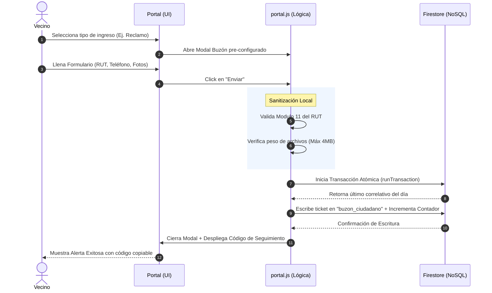

# 🌐 Portal Ciudadano y Motor de Captación SaaS

El **Portal Ciudadano** (`portal.js`, `index.html`, `portal-custom.css`) es la interfaz pública y de cara al usuario de la plataforma SIGEV. Actúa como el principal embudo de captación territorial, permitiendo a los vecinos ingresar solicitudes, enviar iniciativas y realizar seguimiento a sus requerimientos de manera autónoma. Su arquitectura está basada en un modelo SaaS (Software as a Service) Multi-Tenant que adapta la interfaz dinámicamente según la URL.

---

## 1. 📖 Glosario Técnico del Módulo

| Término | Definición Técnica en SIGEV |
| :--- | :--- |
| **Tenant / Subdominio** | Identificador único del espacio de trabajo (Ej: `aguayo`, `paz`). El portal lee la URL para saber qué base de datos y qué estilos visuales debe cargar. |
| **Buzón Ciudadano** | Colección NoSQL (`buzon_ciudadano`) paralela a las solicitudes internas. Recibe datos en crudo que luego el equipo territorial clasifica en el Dashboard. |
| **Transacción Atómica** | Operación de base de datos que garantiza que dos vecinos enviando un ticket en el mismo milisegundo no reciban el mismo número de folio. |
| **Reverse Triage** | Proceso donde el vecino pre-clasifica su requerimiento (Reclamo, Iniciativa, Agradecimiento, Otro) antes de que ingrese a la municipalidad. |
| **Bumper Fade-In** | Técnica UI/UX (opacidad inicial 0 a 1) que oculta el portal hasta que Firebase ha inyectado los colores y logos correctos del Tenant, evitando "parpadeos" visuales. |

---

## 2. 🏗️ Arquitectura SaaS y Multi-Tenant Dinámico

El portal no posee valores estáticos (logos, nombres, colores) escritos en el código HTML. Utiliza un motor de inyección dinámica que lee la URL del navegador para armar la página en tiempo real.

### Mecánica de Detección de Instancia (`portal.js`)
1. **Extracción de URL:** El sistema captura el `window.location.hostname` y aísla el subdominio (Ej: de `sigev-aguayo.cl` extrae `aguayo`).
2. **Validación en Diccionario Local:** Contrasta el subdominio contra la constante `baseConcejalesSaaS`. Si el usuario ingresa por `localhost` o un subdominio no mapeado, el sistema aplica un Fallback al tenant por defecto (`paz` o `aguayo`).
3. **Inyección Reactiva (Hydration):** La función `inicializarPortalPublicoDinamico()` consulta la colección `configuracion_tenant` en Firestore y sobrescribe el DOM (Document Object Model):
   * Modifica variables CSS en caliente (Ej: `--hero-dynamic-bg`).
   * Inserta la imagen de perfil del concejal, logos institucionales y redes sociales.
   * Aplica un Fade-In (`document.body.style.opacity = "1"`) una vez que el portal está renderizado al 100%.

---

## 3. 🛤️ Diagrama de Flujo: Interacción del Vecino

---

## 4. 📥 Motor de Captación: El Buzón Ciudadano

El ingreso de solicitudes se realiza mediante el `#form-buzon-publico`, el cual cuenta con un blindaje multicapa para asegurar que la información llegue limpia al equipo territorial.

### 4.1. Triage Previo (Clasificación Vecinal)
El usuario debe elegir entre cuatro tarjetas de acción que modifican dinámicamente el modal de ingreso (`abrirModalBuzon(tipo)`):
* **🔴 Reportar Problema:** Mapeado como "Reclamo".
* **💡 Enviar Iniciativa:** Mapeado como "Sugerencia".
* **💙 Agradecimiento:** Mapeado como "Felicitación".
* **📝 Otra Consulta:** Mapeado como "Otro".

### 4.2. Sanitización y Reglas de Negocio Client-Side
* **Validación de Identidad (RUT):** El input formatea el RUT en vivo (añadiendo guion) y, al enviar, procesa la función `validarRutAlgoritmoChileno(rut)`. Si el Módulo 11 (Cálculo matemático del Dígito Verificador) no coincide, bloquea el envío para evitar spam o perfiles falsos.
* **Control de Archivos Adjuntos:** El event listener sobre `#buzon-archivos` restringe la subida a un máximo de **5 imágenes**, verificando que ninguna supere el límite de **4 MB** (`4 * 1024 * 1024` bytes) para proteger la cuota de Firebase Storage.

### 4.3. Transacciones Atómicas (Generación de Folios)
Para evitar la colisión de IDs si múltiples vecinos envían solicitudes exactamente al mismo tiempo, la escritura en la base de datos se protege mediante `runTransaction`.
El sistema lee el documento `counters_diarios`, incrementa el número de forma segura en el servidor de Google, y retorna un folio inmutable con el formato `SIG-[YYMMDD]-[XXXX]`.

---

## 5. 🔍 Sistema de Seguimiento de Solicitudes (Tracking)

El portal ofrece un motor de búsqueda transversal para que el vecino audite el avance de su caso sin requerir autenticación ni contraseñas, usando un modelo de "Doble Llave" (RUT + Código de Solicitud).

### Proceso de Búsqueda Multicolección
Al ejecutar la consulta, el sistema realiza barridos progresivos para localizar el ticket:
1. **Paso 1:** Busca en la colección en bruto `buzon_ciudadano` filtrando por el campo `codigo`.
2. **Paso 2:** Si el ticket ya fue derivado por el equipo, busca en la colección matriz `solicitudes` por el campo `codigo`.
3. **Paso 3:** Como medida de seguridad extra (Failsafe), busca en la colección `solicitudes` por el campo heredado `codigoPublico`.

### Renderizado Dinámico de Estados (Badges Inteligentes)
Si el motor encuentra el ticket y verifica que el RUT ingresado coincide matemáticamente con el RUT del propietario del documento, inyecta un bloque HTML de resultados `res-contenedor-estado-dinamico` que "traduce" la jerga municipal para el ciudadano:

| Estado Interno (Firestore) | Lo que ve el Vecino (UI Portal) |
| :--- | :--- |
| `Nuevo` / Vacío | 🟠 **NUEVO:** "Hemos recibido tu solicitud..." |
| `Clasificado` / `En revisión` | 🟡 **EN REVISIÓN:** "Tu solicitud fue analizada y clasificada..." |
| `En gestión` / `Derivado` | 🔵 **EN GESTIÓN:** "Tu requerimiento está siendo atendido..." |
| `Resuelto` / `Finalizado` | 🟢 **RESUELTO:** "Hemos finalizado la gestión. Serás contactado..." |

---

## 6. 📊 Analítica de Captación en Terreno (Lector de Parámetros)

El portal incluye un rastreador silencioso de origen de visitas. Cuando el equipo territorial escanea el Código QR físico generado desde el Dashboard, el código añade un parámetro a la URL (Ej: `?c=aguayo`). 
Al cargar la página, `portal.js` intercepta `window.location.search`, localiza el parámetro y envía un evento a Firebase actualizando el documento `metricas_qr` con la instrucción matemática `increment(1)`. Esto alimenta los KPIs del panel de administración.

---

## 7. 📱 Blindaje CSS y Diseño Responsivo (Mobile-First)

El archivo `portal-custom.css` garantiza que el Portal Ciudadano sea fluido en cualquier dispositivo móvil (que representa +85% del tráfico ciudadano).

* **Reestructuración de Grillas:** La disposición `split-dashboard-container` muta de 2 columnas (`1.1fr 0.9fr`) en PC a una sola columna en cascada (`1fr`) en resoluciones menores a 992px.
* **Control de Degradados del Hero:** En dispositivos móviles, la imagen de fondo de la autoridad no se recorta abruptamente. El CSS altera el `background-position` a `85% 100%` y aplica un gradiente lineal inferior (`linear-gradient(to bottom...)`) para asegurar la legibilidad del título por sobre la fotografía.
* **Interacción Táctil:** Botones redimensionados para tap-targets mínimos de 48px, y menús colapsables que aseguran una navegación intuitiva sin uso del ratón.