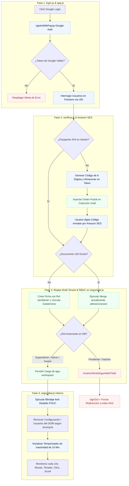

# 🔐 Trilogía de Seguridad: Inicialización, Autenticación y Control de Ciclo de Vida

El esquema de seguridad perimetral e interna de SIGEV se gobierna en cadena por componentes fundamentales que integran el **Shield** (Escudo Interceptor) de la plataforma, protegiendo la integridad NoSQL y el árbol del DOM frente a accesos no autorizados o fugas de sesión en entornos compartidos.

---

## 1. División de Responsabilidades Críticas (Estructura de Archivos)

Para evitar colisiones de lógica y mantener el sistema perfectamente ordenado, las tareas de seguridad se distribuyen de manera estricta bajo una arquitectura descentralizada de responsabilidades separadas:

| Archivo Fuente | Rol en el Shield | Responsabilidad Crítica e Implementación Técnica |
| :--- | :--- | :--- |
| **`app.js`** | **El Motor** | Inicialización pura de servicios Firebase, credenciales del entorno SaaS, conexión a colecciones de la base de datos Firestore y **Persistencia Forzada de la Sesión de Navegador** (`browserSessionPersistence`). |
| **`login.js`** | **La Puerta** | Autenticación OAuth, validación sintáctica de accesos, mapeo inicial SaaS Multi-Tenant y creación de fichas para cuentas en estado pendiente. |
| **`verificar.js`** | **El Inspector** | Interceptor del Segundo Factor (2FA) encargado de computar códigos criptográficos de un solo uso, depositarlos en el almacenamiento volátil del navegador y encolar solicitudes postales en la colección `/mail`. |
| **`seguridad.js`** | **El Guardián** | Control reactivo del árbol del DOM (Ocultación y poda de botones con CSS), **Reloj de 10 minutos por Inactividad**, validación cruzada Multi-Tenant en caliente y disparador de alertas visuales de falta de permisos. |

---

## 2. Diagrama de Flujo Unificado: Cascada del Shield de Acceso



---

## 3. Inicialización Core y Persistencia Forzada (app.js)

La inicialización y configuración base de Firebase y la persistencia de autenticación residen obligatoriamente en `app.js`. Al ser el punto donde se crea e inicializa el objeto `auth`, es el encargado de configurar la persistencia en el disco duro del cliente:

1. **Persistencia de Sesión Forzada:** Utiliza de forma mandatoria la configuración de persistencia a nivel de pestaña del navegador. Esto asegura que si un usuario cierra la pestaña o ventana del navegador por completo, el token de sesión se destruye de inmediato de los buffers locales del disco duro, evitando secuestros de sesión en equipos compartidos.
2. **Neutralización de Firewalls Corporativos:** Para de-saturar y mitigar bloqueos imprevistos en redes e infraestructuras gubernamentales, el motor inicializa la base de datos NoSQL forzando el protocolo de peticiones continuas HTTP de larga duración:

```javascript
const db = initializeFirestore(app, {
    experimentalForceLongPolling: true
});
```
* **Propósito Técnico:** Los firewalls restrictivos de las municipalidades, proxies institucionales y antivirus locales suelen cortar los canales abiertos de comunicación bidireccional (WebSockets nativos). Al forzar `experimentalForceLongPolling`, SIGEV degrada el canal de comunicación a peticiones HTTP continuas de larga duración, blindando la estabilidad de la sincronización NoSQL.

---

## 4. Registro Automatizado de Perfiles y Aislamiento Multi-Tenant (login.js & seguridad.js)

SIGEV opera como una plataforma SaaS Multi-Tenant aislada. El motor evita accesos cruzados entre diferentes instancias municipales (inquilinos concurrentes) distribuyendo la lógica entre la entrada y el guardián:

1. **Extracción de URL:** El sistema captura el subdominio activo inspeccionando la propiedad `window.location.hostname` (Ej: de `sigev-paz.cl` extrae `paz`).
2. **Registro de Operadores Nuevos (login.js):** Al procesarse la autenticación exitosa, el script interroga el nodo de control en `/usuarios`. Si el UID no existe, se bloquea el acceso inyectando un documento con privilegios restrictivos: `rol: "pendiente"`, forzando el amarre de la propiedad `tenantId` al subdominio actual.
3. **Control de Usuarios Recurrentes (login.js):** Si la cuenta ya existe, se descarta la duplicidad de registros y se ejecuta una mutación selectiva combinando la bandera `{ merge: true }`, actualizando únicamente la propiedad `ultimaConexion` con la estampa de tiempo controlada del servidor (`serverTimestamp()`).
4. **Validación Cruzada Inter-Tenant (seguridad.js):** Durante el ciclo de vida de la autenticación, el guardián en `seguridad.js` compara de forma continua la propiedad `tenantId` del documento del usuario con la instancia del subdominio de entrada (o pasaporte asignado en memoria). Si un gestor del espacio municipal "A" intenta forzar el ingreso a la URL del espacio municipal "B", `seguridad.js` detecta la discrepancia y gatilla la revocación instantánea del token.

### 4.1. Override de Sesión Global (Modo Super Admin)
Si el usuario autenticado posee la credencial inmutable de nivel máximo `"SUPER_ADMIN"`, el motor intercepta el flujo de aislamiento Tenant y desactiva el bloqueo de coincidencia de subdominio. El software habilita el parámetro de consulta `?t=` o `?tenant=` en la barra de direcciones de la aplicación (`app.html?t=aguayo`). El script extrae el string parametrizado, sustituye la variable de control `tenantId` en caliente y guarda el pasaporte inyectado dentro del `sessionStorage` (`SIGEV_ACTIVE_TENANT`), permitiendo auditar y administrar bases de datos ajenas desde una única consola.

---

## 5. Matriz Granular de Control de Acceso basado en Roles (RBAC)

La gobernanza interna de datos y acciones de la plataforma se divide en tres niveles estrictos de privilegios. Toda mutación o lectura ejecutada en la interfaz es validada por esta matriz estructural en el servidor antes de ser procesada.

### 👑 5.1. SUPER_ADMIN (Nivel de Infraestructura Global)
* **Alcance:** Control total y centralizado sobre el clúster NoSQL completo de la plataforma. Corresponde de forma exclusiva al equipo de desarrollo e infraestructura de SIGEV.
* **Capacidades Operativas:**
  * Administrar y dar de alta todos los Tenants (organizaciones y comunas independientes).
  * Crear, editar y eliminar de manera definitiva cualquier registro en cualquier colección.
  * Acceder a herramientas forenses para restaurar documentos borrados accidentalmente.
  * Gestionar usuarios, modificar credenciales y escalar roles de nivel maestro.
  * Configurar y para-metrizar las variables de entorno globales del software.
  * Auditar logs transaccionales completos sin restricciones perimetrales.
  * Ejecutar scripts masivos de mantenimiento, parches en caliente y administración de backups.
  * Impersonar cuentas de operadores locales para soporte técnico especializado (Modo Auditor).

### 🏛️ 5.2. CONCEJAL / ADMIN (Nivel de Gobierno de Organización)
* **Alcance:** Responsable de la administración estratégica, analítica y operativa de su propio municipio (Tenant aislado).
* **Capacidades Operativas:**
  * Administrar el padrón de vecinos, expedientes digitales e historiales territoriales de su comuna.
  * Validar y gestionar la bandeja de donaciones comunitarias.
  * Coordinar y agendar hitos en el calendario de actividades territoriales.
  * Gestionar actas, tablas temáticas y votaciones del Concejo Municipal.
  * Administrar el personal interno (cambiar estados y asignar roles a los gestores de su organización).
  * Asignar denuncias o requerimientos a las oficinas municipales correspondientes.
  * Archivar casos resueltos y reabrir folios que requieran nueva fiscalización.
  * Acceder al Dashboard analítico completo, visualización cartográfica del Mapa Territorial e informes macro corporativos.
  * Exportar bases de datos y descargar reportes consolidados en formatos Excel, PDF y CSV.
* **Restricciones Críticas de Seguridad:**
  * ❌ No puede acceder a la Consola de Configuración Global del sistema.
  * ❌ No puede alterar parámetros críticos o lógicas del código core de la base de datos.
  * ❌ No puede visualizar ni administrar bases de datos de comunas ajenas (Tenants colindantes).
  * ❌ No puede ejecutar la purga o eliminación física definitiva de registros (solo borrado lógico o archivado).

### 🤝 5.3. SECRETARIA / GESTOR TERRITORIAL (Nivel Operativo de Campo)
* **Alcance:** Operador de primera línea encargado del levantamiento de datos presencial, digital y el trabajo diario de doble vía con la comunidad.
* **Capacidades Operativas:**
  * Registrar nuevos ciudadanos en el padrón y editar perfiles desactualizados.
  * Levantar solicitudes, reclamos y tickets de ayuda en la bandeja comunal.
  * Registrar aportes y donaciones en las campañas territoriales activas.
  * Operar y actualizar las agendas del Calendario Comunal.
  * Ingresar antecedentes, archivos adjuntos y observaciones críticas en los expedientes de vecinos.
  * Clasificar y aplicar el triage inicial en los requerimientos del Buzón Ciudadano.
  * Agregar comentarios explicativos, bitácoras y registros de avance en los casos.
* **Restricciones Críticas de Seguridad:**
  * ❌ No puede acceder a las secciones de **Configuración**, **Usuarios**, **Reportes**, **Mapa Territorial** ni **Auditoría / Logs**.
  * ❌ No puede eliminar físicamente ningún documento o registro del clúster NoSQL.
  * ❌ No puede archivar casos ni reabrir solicitudes cerradas por la jefatura.
  * ❌ No puede dictaminar el cierre definitivo de un ticket ciudadano.
  * ❌ Bloqueado para la exportación de padrones o descarga de bases de datos en Excel, PDF o CSV.
  * ❌ No puede realizar la ingesta o importación masiva de planillas de cálculo.
  * ❌ No puede visualizar los KPIs estratégicos o indicadores económicos del Dashboard.

---

## 6. El Blindaje Anti-Destello (FOUC) y Pruner del Menú Lateral (seguridad.js)

Para mitigar ataques por manipulación directa de la URL o intentos de inspección del árbol de nodos, `seguridad.js` actúa como un sistema de defensa de borde en el navegador del usuario inyectando estilos de bloqueo antes de que la interfaz complete su renderizado.

### 6.1. Blindaje Anti-Destello (FOUC)
Antes de procesar la respuesta de la base de datos, `seguridad.js` inyecta una hoja de estilos dinámica en el `head` del documento para forzar un `display: none !important;` sobre las pestañas críticas (`configuracion.html`, `usuarios.html`, `reportes.html`, `auditoria.html`). Esto previene el parpadeo visual donde un usuario sin privilegios puede divisar botones restringidos por una fracción de segundo mientras se descarga el payload del rol de Firestore.

### 6.2. Mecánica de Eliminación Física de Nodos
Al confirmarse el rol jerárquico desde la colección `/usuarios`, el script procesa las directrices estructurales de extirpación del DOM:
* **Aislamiento de la Consola Maestra:** Si la propiedad `rol` no es equivalente al string exacto `"SUPER_ADMIN"`, el sistema ejecuta la instrucción `.remove()` sobre el selector de atributo `[data-page="configuracion.html"]`. El nodo se destruye físicamente de la memoria RAM del árbol del DOM, impidiendo que el operador pueda forzar un evento de clic o visualizar la ruta de la consola de gobierno.
* **Aislamiento de Gestión de Personal:** Si el operador posee la credencial `"GESTOR_TERRITORIAL"`, el motor localiza el elemento asignado a la administración de cuentas (`[data-page="usuarios.html"]`) y lo extirpa por completo de la visualización, bloqueando de manera permanente los accesos a los privilegios del personal del municipio.

---

## 7. Temporizador de Inactividad Forzada de 10 Minutos (seguridad.js)

Para evitar la fuga de información sensible o el secuestro de sesiones en computadores que se quedan congelados frente a la pantalla con la pestaña abierta en las oficinas municipales, `seguridad.js` actúa de guardián reactivo en segundo plano.

* **Ventana de Tiempo Rígida:** Se establece un límite máximo de inactividad de **10 minutos** operado mediante la variable global `timeoutInactividad`.
* **Escuchadores Cruzados de Eventos:** El sistema intercepta las acciones del operador acoplando controladores nativos sobre eventos críticos del navegador de manera simultánea: movimientos del ratón, digitación sobre el teclado, clics en la grilla táctil y desplazamiento vertical de la pantalla (`scroll`).
* **Monitoreo y Ciclo de Evaluación:** Cada impacto sobre estos escuchadores limpia el temporizador activo mediante `clearTimeout(timeoutInactividad)` e inicializa nuevamente la cuenta regresiva. 
* **Flujo de Revocación Atómica:** Si el contador expira (pasan los 10 minutos de inactividad absoluta), el "guardián" da la orden directa a Firebase invocando de forma automática la instrucción `signOut(auth)`. Esto revoca los tokens de seguridad, limpia el subdominio del `sessionStorage` y redirige la ventana hacia la raíz de acceso (`index.html`) tras desplegar una alerta amable de falta de actividad o permisos mediante la función `mostrarAlertaSeguridadYSalir()`.

---

## 8. Motor de Validación de Identidad Pública (Módulo 11 Chileno)

Tanto en el Portal Ciudadano externo como en los modales de alta rápida del panel del operador, el sistema integra el método matemático `validarRutAlgoritmoChileno(rut)`. Esta rutina procesa el RUN del beneficiario y determina su validez sintáctica aislando el cuerpo central del dígito verificador.

### 8.1. Algoritmo de Verificación Sintáctica
El software calcula la suma ponderada del cuerpo central en orden inverso multiplicando cada dígito por la serie constante `[2, 3, 4, 5, 6, 7]`:

$$\text{Suma} = (\text{Dígito}_N \times 2) + (\text{Dígito}_{N-1} \times 3) + \dots + (\text{Dígito}_1 \times M)$$

Por consiguiente, el residuo matemático se evalúa bajo las siguientes condiciones de escape algebraicas:
* Si el residuo de $11 - (\text{Suma} \pmod{11})$ resulta exactamente en el valor `11`, el dígito verificador esperado se evalúa contra el string `"0"`.
* Si el resultado matemático es `10`, el dígito verificador se evalúa contra la cadena alfanumérica `"K"`.
* En cualquier otro caso, el residuo numérico se convierte directamente a su representation en string para el contraste final.

---

## 9. Formateador en Vivo y Alertas Visuales en la Interfaz (UI Target)

Para optimizar la experiencia de usuario y mitigar el spam de peticiones inválidas a la base de datos, el formulario de captación implementa escuchadores reactivos directos:
* **Filtros en el Teclado:** El evento de escucha `input` barre caracteres alfabéticos no permitidos, restringe la extensión máxima a 9 dígitos para el cuerpo e inyecta en caliente el guion (`-`) de segmentación.
* **Feedback de Contraste Inmediato:** Si el documento cumple la validez del Módulo 11 mientras el operador tipea, las propiedades visuales del elemento mutan a verde esmeralda (`#059669`) con un somreado de feedback. Si el campo pierde el foco (`blur`) manteniendo anomalías aritméticas, el sistema bloquea el guardado pintando el input en rojo alerta (`#ef4444`) e inyectando un fondo suavizado de advertencia.

---

## 10. Guardián de Segundo Factor (2FA) y Reset de Borde Perimetral (verificar.js & index.html)

Para robustecer el Shield y asegurar el cumplimiento de normativas de auditoría de datos públicos, la plataforma implementa una barrera ineludible de Segundo Factor de Autenticación (2FA) acoplada a un destructor automatizado de tokens en los puntos públicos de entrada.

### 10.1. Ciclo de Vida y Despacho Postal de Tokens
Al resolver con éxito la autenticación OAuth, el script interceptor `verificar.js` evalúa el estado del pasaporte en sesión (`sigev_2fa_autenticado`). Si el parámetro no está presente:
1. **Generación Criptográfica:** El motor computa un número aleatorio de 6 dígitos numéricos rígidos (`100000` a `999999`) y lo aloja de forma aislada en el almacén volátil de la pestaña (`sessionStorage.setItem("sigev_2fa_token")`).
2. **Despacho Postal Seguro:** Inyecta un documento en la colección NoSQL `/mail` con el correo electrónico del funcionario como destinatario. Esto activa la extensión de mensajería en la nube de Firebase, encauzando el envío del código HTML de forma segura a través de la infraestructura transaccional de **Amazon SES**.
3. **Validación de Acceso:** Al digitar el código, el sistema contrasta el string. Si coincide, destruye el token volátil para evitar ataques de reciclaje (`sessionStorage.removeItem`), inyecta la bandera verde de éxito (`sigev_2fa_autenticado = "true"`) y libera el enrutamiento hacia `dashboard.html`.

### 10.2. Reset Obligatorio de Borde (Anti-Bypass de Navegación)
Para evitar que un operador reutilice credenciales, burle la verificación mediante las flechas de navegación hacia atrás (Back) o mantenga permisos tras un cierre irregular, la Landing Page (`index.html`) actúa como una trampa de liquidación perimetral:

```javascript
// 🚨 RESET DE SEGURIDAD ABSOLUTO (index.html)
document.addEventListener('DOMContentLoaded', () => {
    sessionStorage.removeItem("sigev_2fa_autenticado");
    sessionStorage.removeItem("sigev_2fa_token");
});
```

* **Mecánica Arquitectónica:** En el instante en que el navegador monta la interfaz de la Landing Page, el escuchador de carga limpia y destruye físicamente cualquier rastro de las llaves `sigev_2fa_autenticado` y `sigev_2fa_token` de la memoria intermedia del cliente. Esto revoca los privilegios locales de inmediato. Si el operador presiona el botón "Iniciar sesión con Google" nuevamente, el Shield detectará la ausencia de los tokens de sesión y lo forzará obligatoriamente a pasar por `verificar.html` para generar un nuevo despacho postal, blindando la frontera del Workspace municipal.