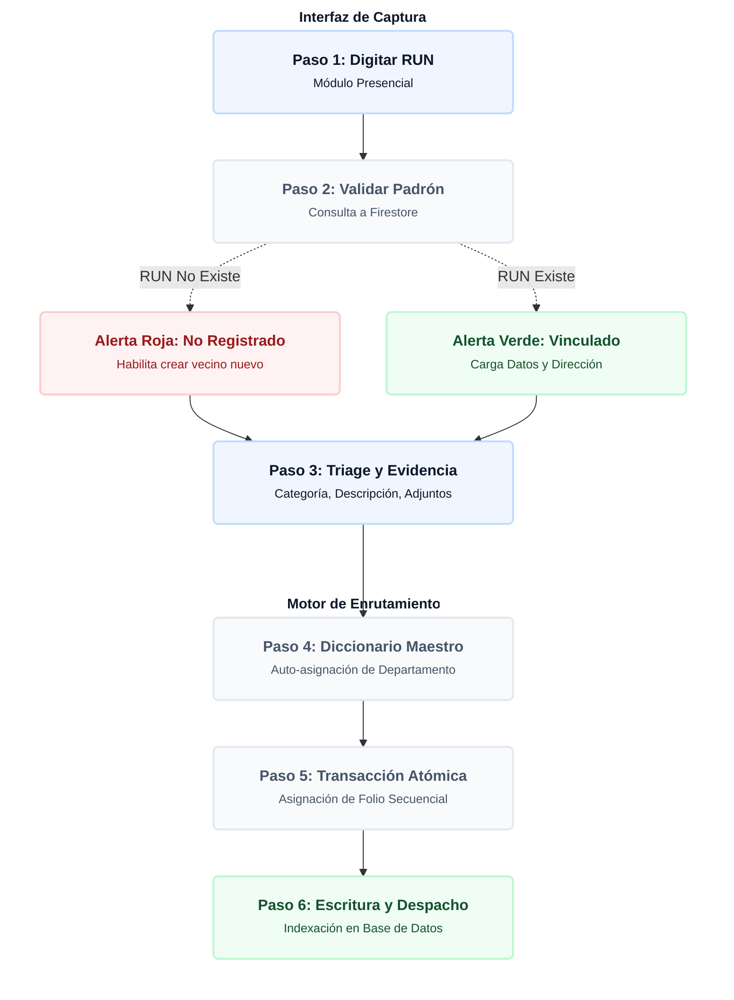

# 📊 Motor de Solicitudes, Triage y Trazabilidad

El módulo `solicitudes.js` gobierna el ciclo de vida completo de los requerimientos ingresados en SIGEV. Su arquitectura permite unificar solicitudes provenientes del portal público y del módulo presencial, transformando texto plano en un ticket indexado bajo una matriz de enrutamiento institucional y un control de calidad bifásico.

---

## 1. Diagrama de Flujo: Captura de Casos y Enrutamiento de Triage

El siguiente diagrama detalla la arquitectura lógica que ejecuta el sistema desde el momento en que se digita el RUN de un vecino en terreno hasta la generación de los folios indexados con enrutamiento departamental automático:

---

## 2. Matriz de Triage Automatizado y Codificación Dual

El sistema utiliza un diccionario maestro estático denominado `MAPA_CLASIFICACION_SIGEV` que automatiza el enrutamiento de requerimientos y la generación de métricas de carga de trabajo.

### Estructura de la Matriz (`MAPA_CLASIFICACION_SIGEV`)
Cada categoría macro (Ej: *Ayuda Social, Alumbrado, Aseo y Basura, Seguridad*) tiene amarrado:
* **`depCod` / `depName`:** Identificador y nombre del departamento receptor (Ej: `DIMAO`, `DIDESO`, `OBRAS`, `SEGURIDAD MUNICIPAL`).
* **`catCod`:** Código abreviado de la categoría raíz (Ej: `SOC`, `ALU`, `ASE`, `SEG`).
* **`subs`:** Un mapa de subcategorías específicas vinculadas a un código único de tres letras (Ej: `Giftcard: "GIF"`, `Baches: "BAC"`, `Poda árboles: "POD"`).

### El Estándar de Codificación Dual
Para balancear la simplicidad hacia el vecino y la precisión analítica para el equipo de gestión, SIGEV genera dos identificadores únicos por requerimiento:

1. **Código Público (Orientado al Vecino):** Formato: `SIG-[YYMMDD]-[CORRELATIVO]` (Ej: `SIG-260613-0004`). Es corto, legible y optimizado para el portapapeles y consultas rápidas de seguimiento.
2. **Código Interno (Orientado al Gobierno de Datos):** Formato: `SIG-[TNT]-[YYMMDD]-[CORRELATIVO]-[DEP_COD]-[CAT_COD]-[SUB_COD]` (Ej: `SIG-PAZ-260613-0004-DMA-VER-PEL`). Contiene toda la metadata de enrutamiento inyectada de forma nativa en el string, lo que permite realizar búsquedas, indexaciones y agrupaciones en la base de datos de manera inmediata.

---

## 3. Lógica de Resolución en Dos Pasos (Flujo de Calidad)

El sistema implementa un control de calidad en dos fases dentro de la función del botón `btn-guardar-gestion` para garantizar que ninguna respuesta incompleta o errónea sea visualizada por el ciudadano en el portal público.

* **Paso 1: Resolución Técnica Interna:** El equipo en terreno ejecuta la acción municipal y registra la solución en la variable `detalleInternoResolucion`. El estado de gestión interna pasa a `"Finalizado en espera de respuesta"`. Sin embargo, para mantener el control y no alterar la percepción del vecino, la variable pública `estado` se mantiene congelada en `"En Gestión"`.
* **Paso 2: Redacción de Respuesta Final:** El Concejal o Super Admin revisa la resolución técnica en la consola. Al validar la información, redacta la respuesta definitiva en la variable `respuestaVecino`. En este instante, el estado de gestión interna muta a `"Finalizada (Caso Respondido)"` y la variable pública cambia oficialmente a `"Resuelto"`, liberando el ticket en el portal del ciudadano.

---

## 4. Contadores Crono-Secuenciales Atómicos

Para evitar que los folios públicos colisionen si dos operadores ingresan una solicitud presencial al mismo tiempo desde distintas estaciones de trabajo, el sistema implementa una lógica de bloqueo concurrente.
* **Reinicio a Medianoche:** SIGEV utiliza la fecha del servidor en formato cadena (`YYMMDD`) como llave dinámica dentro del documento `counters_diarios`. 
* **Atomicidad NoSQL:** El método `runTransaction` interroga el contador del día actual. Si existe, lo incrementa en `+1`; si el día cambió en el servidor, inicializa la secuencia automáticamente en `1`. La base de datos no procesará el alta de la solicitud hasta que la transacción del número correlativo se haya consolidado en la nube.

---

## 5. Línea de Tiempo de Trazabilidad Dinámica

El sistema no almacena un historial pesado de logs de texto para armar la línea de tiempo. En su lugar, reconstruye la hoja de vida de la solicitud de forma eficiente analizando los *timestamps* nativos de Firestore en memoria RAM:

* El método `btnHistorial.onclick` evalúa la existencia de las variables cronológicas del ciclo de vida del ticket (`fechaCreacion`, `fechaClasificacion`, `fechaDerivada`, `fechaEnGestion`, `fechaResueltoInterno`, `fechaFinalizada`).
* Los actores del flujo se limpian dinámicamente mediante la función `formatActor()`, la cual normaliza el nombre del operador removiendo paréntesis y formateando el texto para desplegar un rol jerárquico estandarizado (*"ADMINISTRADOR"* o *"PRIMER_NOMBRE APELLIDO"*).

---

## 6. Glosario de Conceptos Clave (Solicitudes)

| Término | Significado |
| :--- | :--- |
| **Triage Municipal** | Proceso automatizado por el cual SIGEV asigna un requerimiento a un departamento específico basándose en el mapa de clasificación de la categoría elegida. |
| **Finalizado en espera de respuesta** | Estado intermedio donde la solución técnica en terreno está completada, pero el ticket sigue abierto para el ciudadano a la espera de la redacción oficial. |
| **Registro Presencial** | Solicitudes tomadas en terreno por el equipo técnico utilizando el validador de RUN para inyectar el requerimiento dentro del expediente único del vecino. |
| **KPIs Analíticos de Respuesta** | Panel superior de métricas que calcula la tasa de resolución, demora promedio, categoría frecuente y carga departamental en tiempo real sin generar lecturas extras a la base de datos. |

---

## 7. Flujo de Captura Presencial (Workflow)

Cuando un vecino asiste a la oficina territorial o un gestor levanta un requerimiento en terreno:
1. **Comprobación de Identidad Inmediata:** El operador digita el RUN en el campo `tr-rut`. El motor dispara un evento `input` y `blur` asíncrono que interroga la colección `vecinos` bajo el `Tenant ID` actual.
2. **Bifurcación del Flujo:**
   * *Caso Vecino Existe:* El sistema recupera el nombre oficial, bloquea el campo de texto inyectando un estado visual verde (`✓`), precarga la dirección e inicializa el botón de guardado del ticket.
   * *Caso Vecino Nuevo:* El sistema arroja un estado de alerta rojo (`✗ No Registrado`), oculta el botón de envío del ticket y habilita el botón de acción condicional `"👤 Crear Ficha del Vecino"`, redirigiendo al operador al formulario modular de registro avanzado.
3. **Despacho del Ticket:** Al completar la descripción y el triage de área, se consolida la transacción y se levanta una cápsula de alerta premium que permite copiar el nuevo código público con un solo clic.

---

## 8. Optimizaciones de Interfaz y CSS Premium

El archivo `solicitudes.css` e `html` resuelven dos problemas críticos de diseño y experiencia de usuario:

* **Liberación del Scroll Principal:** Se eliminaron las restricciones de altura fija (`height: 100vh`, `max-height`) en las clases estructurales (`html`, `body`, `.app-container`, `.main-content`). Al forzar `height: auto !important` y `overflow-y: auto !important`, el navegador recupera el control del scroll natural, eliminando las cajas anidadas y los molestos cortes de pantalla en monitores pequeños.
* **Uniformidad Estética de los Selectores:** Para evitar que los elementos `<select>` nativos de los navegadores muestren flechas diferentes según el sistema operativo (Windows, Mac, Android), se aplicó `-webkit-appearance: none !important` y se inyectó una flecha vectorial mediante una imagen en formato `data:image/svg+xml`. Esto garantiza que los menús de categorías se desplieguen idénticos en cualquier pantalla.

---

## 9. Arquitectura de Almacenamiento Binario (Firebase Storage)

El motor de solicitudes está preparado para la carga asíncrona de evidencias fotográficas y documentos de respaldo a través de la API de **Firebase Storage**, operando bajo una estrategia de desacoplamiento de red:

1. **Captura en Buffer Local:** Cuando el usuario interactúa con la zona de arrastre (`file-dropzone` o `tr-adjuntos`), el archivo se valida en el cliente controlando que no supere los **10 megabytes** y que cumpla con los formatos autorizados (`PDF`, `JPG`, `PNG`).
2. **Estrategia de Rutas Deterministas:** Los archivos binarios no se guardan con nombres aleatorios en la raíz. Se estructuran dinámicamente en buckets bajo el siguiente patrón jerárquico de aislamiento:  
   `tenants/{tenantId}/solicitudes/{fechaStr}/{codigoPublico}/{nombre_archivo}`
3. **Resolución de Promesas e Inyección NoSQL:** El archivo se sube a Storage mediante `uploadBytes`. Una vez completado el progreso, se recupera la URL de descarga pública a través de `getDownloadURL()`. Esta URL estructurada en texto se inyecta como un elemento dentro del arreglo `adjuntos: []` en el documento de Firestore, evitando almacenar binarios pesados en la base de datos NoSQL.

---

## 10. Esquema del Documento de Datos (Estructura de Payload NoSQL)

Para auditorías técnicas y futuros desarrollos, el documento final indexado en la colección `solicitudes` de Cloud Firestore presenta la siguiente anatomía de variables:

<pre>
{
  "tenantId": "paz",
  "idVecino": "v_doc_id_alphanumeric_firebase",
  "vecinoNombre": "Juan Pérez",
  "vecinoRut": "12.345.678-9",
  "vecinoTelefono": "+56 9 1234 5678",
  "vecinoDireccion": "Av. Lo Ovalle 1234, Block 4, Depto 201",
  "codigo": "SIG-260613-0004",
  "codigoInterno": "SIG-PAZ-260613-0004-DMA-VER-PEL",
  "categoria": "ÁREAS VERDES",
  "motivo": "ÁREAS VERDES",
  "subcategoria": "Árbol peligroso",
  "oficinaDerivada": "DIMAO",
  "prioridad": "Alta",
  "descripcion": "Árbol con peligro inminente de caída sobre cableado público.",
  "estado": "Clasificado",
  "estadoGestion": "En revisión",
  "origen": "Registro Presencial",
  "registradaPorNombre": "ADMINISTRADOR",
  "registradaPorFoto": "https://images.unsplash.com/... (URL)",
  "asignadoA": "Gonzalo Aguayo",
  "ultimaGestionPor": "ADMINISTRADOR",
  "notasGestion": "Se requiere coordinar con cuadrilla de emergencia nocturna.",
  "detalleInternoResolucion": "Corte de ramas peligrosas ejecutado el 14/06.",
  "respuestaVecino": "Estimado vecino, le informamos que la cuadrilla de DIMAO retiró las ramas...",
  "fechaCreacion": "Timestamp (Server)",
  "fechaClasificacion": "Timestamp (Server)",
  "fechaDerivada": "Timestamp (Server)",
  "fechaEnGestion": "Timestamp (Server)",
  "fechaResueltoInterno": "Timestamp (Server)",
  "fechaFinalizada": "Timestamp (Server)",
  "adjuntos": [
    "https://firebasestorage.googleapis.com/...evidencia1.jpg",
    "https://firebasestorage.googleapis.com/...certificado.pdf"
  ]
}
</pre>