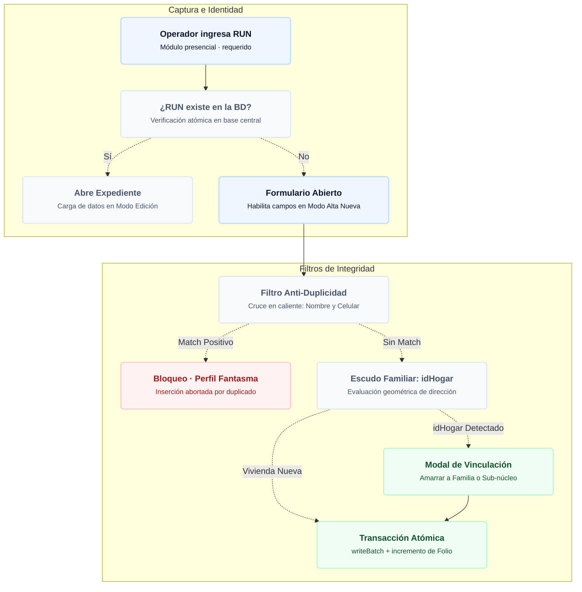
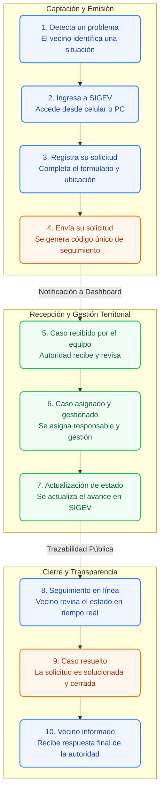

# 👥 Motor del Padrón de Vecinos y Georreferenciación

El módulo `vecinos.js` es el núcleo de inteligencia territorial de SIGEV. No es un simple mantenedor de registros (CRUD), sino un motor de cruce de datos que vincula a las personas con su territorio, su núcleo familiar y su historial de solicitudes, respetando estrictamente el aislamiento Multi-Tenant.

---

## 1. Diagrama de Flujo: Registro y Validación Interna de Vecinos
Azul = requerido · Gris = opcional · Verde = validación exitosa · Rojo = bloqueo de seguridad



---

## 2. 🗺️ Flujo del Vecino: Journey Ciudadano y Trazabilidad

Para comprender el ciclo de vida completo de la información en SIGEV, el sistema orquesta un proceso de 10 pasos que conecta las necesidades de la comunidad con la gestión interna del municipio. Este ecosistema se fundamenta en cuatro pilares: **Transparencia, Trazabilidad, Participación y Eficiencia**.

### Los Tres Actores del Ecosistema
1. **Vecino:** Reporta, consulta y participa para mejorar su comunidad.
2. **SIGEV (Plataforma):** Plataforma digital que conecta, organiza y da trazabilidad.
3. **Autoridad / Equipo:** Gestiona, responde y resuelve para mejorar la calidad de vida en el territorio.

### Diagrama de Flujo: Los 10 Pasos de Interacción



---

## 3. Arquitectura de Georreferenciación

SIGEV incorpora un sistema dual para posicionar a los vecinos en el mapa, eliminando la necesidad de que los equipos territoriales ingresen coordenadas manualmente.

### Asistente de Mapeo Satelital (Masivo)
Para organizaciones que migran desde planillas Excel sin latitud/longitud, el sistema incluye una rutina de geocodificación masiva.
* **Proveedor:** API de Nominatim (OpenStreetMap).
* **Flujo seguro:** Las solicitudes se procesan con un retraso inducido (`1200ms` entre peticiones) para no saturar la API gratuita y evitar bloqueos por tasa de peticiones (Rate Limit).
* **Escritura en Lotes:** Usa `writeBatch` de Firestore para guardar los resultados de forma eficiente cada 400 registros, minimizando el costo de lecturas/escrituras en la nube.

### Detección Automática de Sectores (Point-in-Polygon)
Cuando un vecino es posicionado en el mapa (ya sea manual o por lote), SIGEV ejecuta la función `autoDetectarSector(lat, lng)`. 
* Utiliza el algoritmo matemático de **Ray-Casting** (Point-in-Polygon) cruzando las coordenadas exactas contra las fronteras poligonales de los 6 Sectores Territoriales definidos en la matriz. 
* Esto asegura que ningún vecino sea asignado a un sector equivocado por error humano.

---

## 4. Escudo de Cruce Familiar e Identificadores

Para reflejar la realidad territorial, SIGEV no trata a los vecinos como entes aislados, sino como partes de un ecosistema habitacional.

### Lógica del `idHogar`
Cuando se registra una dirección (Ej: *Av. Principal 1234 - Depto 201*), el sistema normaliza el texto y genera un string único (Ej: `HOG-av-principal-1234-depto-201`).
* **Interceptación Visual:** Si el sistema detecta que un nuevo vecino coincide con un `idHogar` existente, dispara el modal **"Escudo de Cruce Familiar"**.
* **Decisión Humana:** El operador puede elegir "Amarrar" al nuevo individuo al núcleo familiar existente o crear un núcleo independiente (añadiendo el sufijo `-IND-` más un timestamp temporal).

### Prevención de "Perfiles Fantasma"
Para evitar la duplicidad de datos cuando los vecinos son ingresados sin RUN (desde un Excel defectuoso o un contacto rápido), el sistema cruzará el **Teléfono Celular** y el **Nombre Normalizado** (sin tildes, en minúsculas) antes de permitir una nueva inserción. Si detecta un "fantasma", bloquea la creación y sugiere actualizar el perfil existente.

---

## 5. Seguridad Estructural y Transacciones

### Aislamiento Multi-Tenant

> [!WARNING]
> **⚖️ Arquitectura Restrictiva:**
> Todas las consultas a las colecciones de Firestore (`vecinos` y `solicitudes`) llevan inyectado un filtro estricto: `where("tenantId", "==", CURRENT_TENANT_ID)`. Esto garantiza por arquitectura de software que un municipio jamás pueda leer, modificar ni listar a los vecinos de otro municipio.

---

## 6. Glosario de Conceptos Clave

Para estandarizar el desarrollo y el mantenimiento del módulo de vecinos, se definen los siguientes términos técnicos y de negocio utilizados en el código:

| Término | Significado |
| :--- | :--- |
| **Tenant ID (`CURRENT_TENANT_ID`)** | Identificador único del cliente (municipio, concejalía, ONG) extraído dinámicamente del subdominio de la URL. Define el límite absoluto de los datos que se pueden leer o escribir. |
| **idHogar** | Código alfanumérico generado a partir de la normalización de la dirección (Ej: `HOG-av-principal-1234`). Sirve como llave foránea (Foreign Key) para agrupar vecinos en un mismo núcleo familiar. |
| **Scoring Vecinal (Índice)** | Algoritmo que clasifica al vecino en Activo (Verde), Medio (Naranja) o Bajo (Rojo), dependiendo matemáticamente de su volumen de interacciones e ingresos al Buzón Ciudadano. |
| **Padrón Fantasma** | Expedientes residuales importados desde Excel que carecen de RUN válido (ej: `S/R-1234`). El sistema bloquea su duplicación cruzando fonética de nombres y números de teléfono. |
| **Folio Correlativo** | Identificador visual de 5 dígitos (Ej: `SIG-VEC-00015`) generado mediante transacciones atómicas de Firebase para uso humano, independiente del ID alfanumérico autogenerado por Firestore. |

---

## 7. Flujos de Trabajo Principales (Workflows)

El sistema opera bajo flujos estrictos de validación para mantener la integridad de los datos territoriales.

### Flujo 1: Alta Avanzada de un Vecino
Cuando un gestor territorial presiona "+ Registrar Vecino", el sistema ejecuta la siguiente cascada de seguridad:
1. **Validación de RUN Previa:** Se ingresa el RUT. El sistema consulta si existe en el `Tenant ID` actual.
2. **Anti-Duplicidad (Fantasmas):** Al intentar guardar, se normaliza el nombre y se cruza el teléfono. Si hace *match* con un vecino sin RUT, la base de datos aborta el guardado y emite una alerta.
3. **Escudo de Cruce Familiar:** Se calcula el `idHogar` basado en la dirección. Si hace *match* con una vivienda existente, un modal interrumpe el flujo y obliga al operador a decidir si es un "Familiar" o un "Núcleo Independiente".
4. **Transacción Atómica:** Se escribe el documento en la colección `vecinos` y simultáneamente se incrementa el documento `counters_diarios` en un solo pulso de red (`runTransaction`).

### Flujo 2: Rutina de Mapeo Satelital Masivo
Diseñado para hidratar el mapa cuando se importan vecinos masivamente sin coordenadas:
1. **Detección (Triage):** El sistema filtra en memoria RAM a los vecinos cuyo estado es `"Pendiente de Georreferenciación"` y que posean una dirección escrita válida.
2. **Rate-Limiting:** Por cada vecino, se lanza un `fetch` a la API de Nominatim con un `setTimeout` forzado de `1200ms` para evitar baneos de IP por parte del proveedor satelital.
3. **Point-in-Polygon:** Con la latitud y longitud obtenidas, se ejecuta el cruce contra los polígonos del mapa para inyectar automáticamente la variable `sectorTerritorial`.
4. **Escritura en Lotes (Batch):** Los resultados no se guardan 1 a 1. Se empaquetan usando `writeBatch(db)` y se envían a la nube de a 400 registros para optimizar el rendimiento y costo de Firestore.

---

## 8. Enrutamiento Contextual e Interconexión (Deep Linking)

SIGEV implementa un mecanismo de persistencia visual y ruteo dinámico mediante parámetros URL en la función `verificarYFocalizarExpedienteDesdeBuzon()`.

* **Objetivo:** Permitir que si un operador viene desde otra pestaña del sistema (como el Buzón Ciudadano) haciendo clic en el perfil de un vecino, el sistema no lo obligue a buscarlo manualmente en la tabla.
* **Lógica de Normalización de RUT:** El motor captura el parámetro `?rut=`, remueve puntos, guiones y espacios en blanco, y genera una matriz de búsqueda con todas las variaciones posibles de formato (con/sin puntos, cuerpo limpio, DV en mayúsculas). 
* **Focalización Automática:** Si encuentra una coincidencia exacta en la memoria local o en Firestore, inyecta el RUT directamente en el buscador de la tabla, ejecuta el filtrado instantáneo y levanta el panel lateral derecho con la ficha del vecino precargada de forma transparente.

---

## 9. Optimización UI y Respeto al Ciclo de Vida del Mapa

Un problema crítico clásico al integrar mapas de **Leaflet** dentro de elementos ocultos de la interfaz (como pestañas CSS con `display: none` o ventanas modales flotantes) es que el mapa se rompe, se pixela o carga con sus contenedores en un tamaño de `0x0` píxeles.

Para blindar la experiencia de usuario, SIGEV implementa una estrategia de **invalidación asíncrona de tamaño**:

```javascript
setTimeout(() => miniMapa.invalidateSize(), 60);
setTimeout(() => miniMapa.invalidateSize(), 300);
```

* **Mecánica:** Al abrir la consola avanzada o cambiar de pestaña en el visor de datos básicos, el motor dispara retrasos controlados (`60ms` y `300ms`) que fuerzan a Leaflet a recalcular de manera geométrica las dimensiones reales del viewport una vez que el navegador ha terminado de renderizar la caja del modal. Esto asegura que el pin y las capas satelitales se desplieguen alineadas al centro cartográfico.